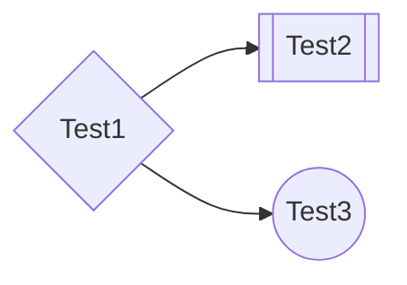
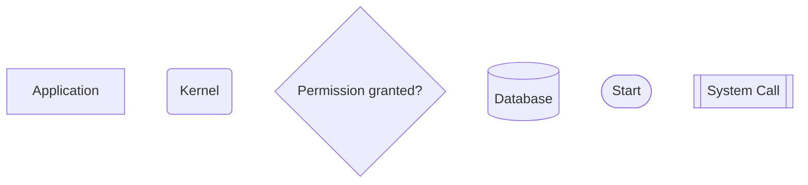
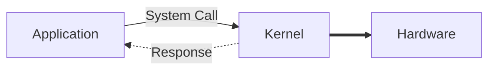
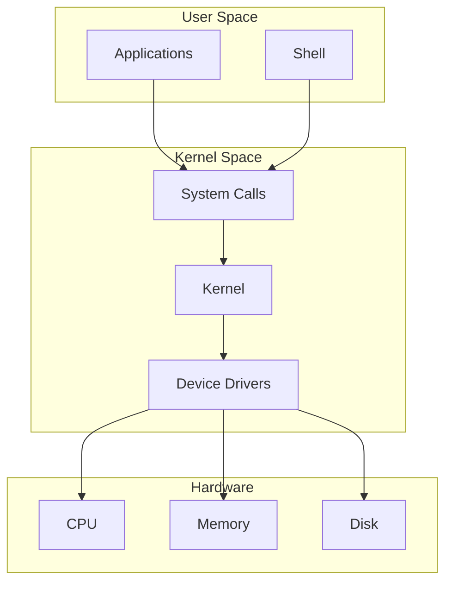
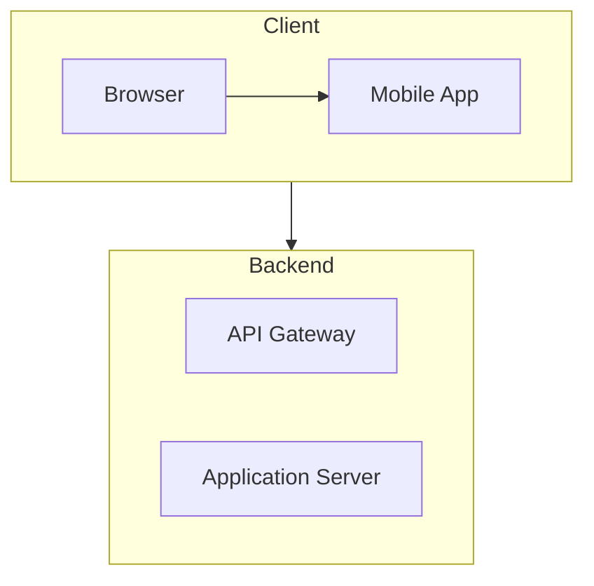
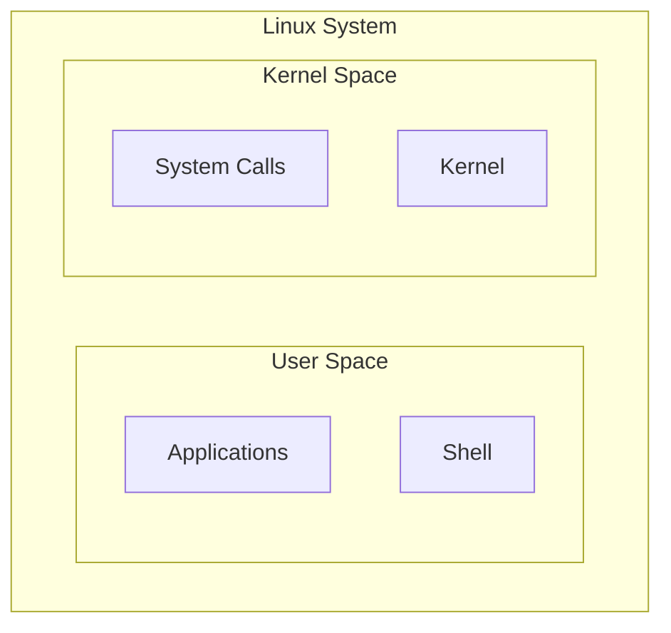

```mermaid
flowchart LR
	A{Test1}
	B[[Test2]]
	C((Test3))
	
	A --> B
	A --> C
```

```mermaid
flowchart TD
    A[Application]
    B(Kernel)
    C{Permission granted?}
    D[(Database)]
    E([Start])
    F[[System Call]]
```

```mermaid
flowchart LR
    A[Application] -->|System Call| B[Kernel]
    B -.->|Response| A
    B ==> C[Hardware]
```

```mermaid
flowchart TD

    subgraph UserSpace["User Space"]
        A[Applications]
        B[Shell]
    end

    subgraph KernelSpace["Kernel Space"]
        C[System Calls]
        D[Kernel]
        E[Device Drivers]
    end

    subgraph Hardware["Hardware"]
        F[CPU]
        G[Memory]
        H[Disk]
    end

    A --> C
    B --> C
    C --> D
    D --> E
    E --> F
    E --> G
    E --> H
```

```mermaid
flowchart TD

    subgraph A["Client"]
	        A1[Browser]
	        A2[Mobile App]
	        A1 --> A2
    end

    subgraph B["Backend"]
        B1[API Gateway]
        B2[Application Server]
    end

    A --> B
```

```mermaid
flowchart TD

    subgraph Linux["Linux System"]

        subgraph UserSpace["User Space"]
            A[Applications]
            B[Shell]
        end

        subgraph KernelSpace["Kernel Space"]
            C[System Calls]
            D[Kernel]
        end

    end
```
