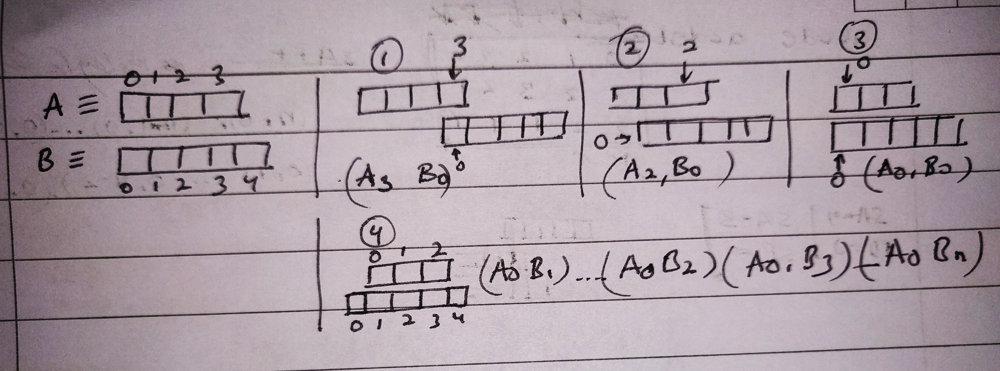

## **Convert binary to decimal**

### *Algo 1* : 

Take a variable num = 0 and multiplier m = 1. Traverse the binary number (32 bits), if current element is 0 do nothing. If it is 1 add multiplier to num. For each iteration keep multiplying m by 2.

``` cpp 
int solve( arr[] ){
    int n = 0, m = 1;
    for(ele in arr){
        if(ele == 1) n += m;
            m *= 2;
        }
    return n;
} 
```

### *Algo 2* :

Similar to *Algo 1*, except way to multiply is diffrent. Rather than multiplying we will add `(1 << i)` to `n`. **Can  be useful when dealing with Integer directly**

``` cpp
int solve( int x ){
    int n = 0;
    for(i in [31, 0]){
        if(ith bit is 1) n += (1 << i);
    }
    return n;
}
```
----
* String comparison/matching algos: 
    * DFS
    * Tries
    * KMP (longest prefix which is also a suffix) <span style="color: red;">**(vv imp)**</span>
* DFS and Trie can be used when single string is to be macthed with multiple string. Like, *Find "ab" in ["bc", "ab",   "gf"]*
* KMP is used to find substring in a string.

* For 2 numbers a, b : **`(a|b) >= max(a, b)`**
* If we need to check whether string *A* can be fromed by rotating string *B*, then this is only possible if : <span style="color: yellow;">*B is substring of (A+A)*</span>
* To check if 2 strings are made up of same smaller substrings: For example, check if "ABCABC" and "ABCABCABC" are  made  up of same string. They both made up of "ABC".
`s1 = "ABCABC", s2 = "ABCABCABC"`, this condition should hold <span style="color: yellow;">*(s1 + s2) == (s2 + s1)*</span>. For this case, `s1 + s2 = "ABCABCABCABCABC"` and `s2 + s1 = "ABCABCABCABCABC"`, which are same. This condition will not hold for `s1 = "ABCABC", s2 = "ABXABX"` as `s1 + s2 = "ABCABCABXABX"` and `s2 + s1 = "ABXABXABCABC"`.
* <span style="color: yellow;">The first bit from the right in binary representation on a number is the only bit responsible for making an element even or odd.</span> This is because the value of this bit is 1, and the value of all the other bits are even as the are power of 2. For example, `6 = 110, 7 = 111, 8 = 1000, 12 = 1100`. All the odd numbers will always have 1<sup>st</sup> bit as 1. Also the as sum of all the even number is always even, so the binary representation should always have a bit which gives odd value `i.e rightmost bit`. 
* Because of the above reason, XOR of 2 even and 2 odd numbers will always be odd, because 1<sub>st</sub> rightmost bit will be 0 for even number and 1 for odd number and ***XOR(1, 1) = XOR(0, 0) = 0***. And similarly XOR of even and odd number will always be odd as ***XOR(1, 0) = XOR(0, 1) = 1***. Thus 1<sup>st</sup> bit from right will be 1 after XOR operation.   

    <span style="color: yellow;">*XOR(even, odd) = XOR(odd, even) = odd*</span>

    <span style="color: yellow;">*XOR(even, even) = XOR(odd, odd) = even*</span>

* Total number of subset formed from array of length = 2<sup>arr.size()</sup> or `1<<arr.size()`.
* If the total number of subset are n for an array, then every number's binary representation from 0 to n will tell us which numbers to include in the subset.

    For example, arr = [1,2,3]. So n = 8;

    1 = 001 => subset (arr[0])

    2 = 010 => subset (arr[1])

    3 = 011 => subset (arr[0], arr[1])

    4 = 100 => subset (arr[2]) and so on.

    ```cpp
    void subset(arr[]){
        int subsets = (1 << arr.size());
        for(int i=0; i<subsets; i++){
            // i is showing numbers
            for(int j=0; j<arr.size(); j++){
                // checks if j-th bit of i is set or not.
                if(i & (1<<j)){
                    // use the element arr[j]
                }
            }
        }
    }
    ```

* If A^B=C, then B^C=A and A^C=B.
* XOR of same number is always 0, following this if given an set of n numbers like a<sub>1</sub>, a<sub>2</sub>,a<sub>3</sub>...a<sub>n</sub> and <span style="color: yellow;">XOR(a<sub>1</sub> ^ a<sub>2</sub> ^ a<sub>3</sub> ^ ... ^ a<sub>n</sub>) = 0, then always XOR(a<sub>1</sub> ^ a<sub>2</sub> ^ a<sub>3</sub> ^ ... ^ a<sub>j</sub>) = XOR(a<sub>j+1</sub> ^ a<sub>j+2</sub> ^ a<sub>j+3</sub> ^ ... ^ a<sub>n</sub>)</span>
* [Last Stone Weight 2](https://leetcode.com/problems/last-stone-weight-ii/) : A very good variation of [Partition a set into two subsets such that the difference of subset sums is minimum](https://www.geeksforgeeks.org/partition-a-set-into-two-subsets-such-that-the-difference-of-subset-sums-is-minimum/)
* Overlapping 2 arrays. We will pass array B below array A and note the starting overlapping index.

    

    In the image above B[0] is under A[n-1], in next step B[0] is under A[n-2]... B[0] is under A[0] at this instance B is completely under A. Now in next step B[1] is under A[0], B[2] is under A[0]...B[m-1] is under A[0].

    Uses : [Longest Common Subarray](https://leetcode.com/problems/maximum-length-of-repeated-subarray/) (DP can also be a solution but this solution takes no space.)

    In reference to this problem: 

    A = [1,2,4,3,2,1,6,7,8]
    B =   [4,5,3,2,1,6,9]

    At instance when B[0] is under A[2] we can see that [3,2,1] are aligned and the longest subarray can be found.

    ```cpp
    // code to generate this overlapping indices
    int solve(A[], B[]){
        int n = A.size(), m = B.size();
        // B will be 0 A will move from 0 to n-1
        for(int i=0; i<n; i++){
            // use A[i], B[0]
        }
        for(int i=0; i<m; i++){
            // use A[0], B[i]
        }
    }
    ```
* <span style="color: yellow;"> auto[x, y] = // something that returns pair; // x and y are variables </span>
* In problem *Reach a target by adding elements in an array*, which is knapsack problem, you can achieve this in a 1-D dp if j is  from [sum, 0] rather than [0, sum].   
    ```cpp
    for(int i=1; i<=n; i++){
        for(int j=sum; i>=0; j--){
            // dp[i][j].....
        }
    }
    ```   
* To check if a number n is a power of 2, <span style="color: yellow;">n & (n-1) = 0</span>. If n is power of 2 it will have only one bit set i.e 8 := 1000, as n-1 is just 1 behind n it will have all bit set to except that set in n i.e 7 := 0111, thus and of n, n-1 will always be 0. Example : `Check if frequence of all the element in set has atmost one odd frequence.`
* Catalan Numbers : 
    
    i) C<sub>n</sub> = <sup>2n</sup>C<sub>n</sub> - <sup>2n</sup>C<sub>n+1</sub>, for n >= 0

   ii) C<sub>0</sub> = 1, C<sub>n+1</sub> = (2(2n + 1)/(n+2)) * C<sub>n</sub>
* [Application of Catalan Numbers](https://www.geeksforgeeks.org/applications-of-catalan-numbers/)
* Tip : For greedy problems where we have to find k<sup>th</sup> most frequent, closest, greatest, smallest element then try thinking of QuickSelect and Binary Search. The question might also follow than answer can be in any order.
* Problems where we need to know the state till i<sub>th</sub> index of the array and the state of from (i+1)<sub>th</sub> index to the last of array, try to use 2 auxillary arrays, one to store the state of any index from left to right and the other to store the state of every index from right to left. *State can be anything, for example knowing number of distinct element till ith index and number of distinct element for i+1 to nth index.*
* Set in cpp store element in sorted order.
* Root is the only node without parent.
----
## **Rotate an array by k**
### *Algo 1* : 

Reverse the array completely. Then reverse the array from (0, k-1). And then from (k, n-1).

*Example :* arr = [1,2,3,4,5,7]; k = 3
            o/p => [5,6,7,1,2,3,4]
            
            * [7,6,5,4,3,2,1] --> reverse(arr, 0, n-1)
            * [5,6,7,4,3,2,1] --> reverse(arr, 0, k-1)
            * [5,6,7,1,2,3,4] --> reverse(arr, k, n-1)

---
## **Best time to buy sell stock (version 1)**
Can buy and sell only once.
### *Algo 1*:

While buying the stock keep track on minimum value stock encountered. For every element min(element<sub>i</sub>, curr_min). And for the answer, keep track of maximum value obtained from subtracting curr_min from element<sub>i</sub>. The goal of the question is to get <span style="color: yellow;">*maximum difference between two elements such that larger element appears after the smaller number*</span>

``` cpp
int maxProfit(int arr[]) {
        int m = INT_MAX;
        int ans = 0;
        for(int i : arr){
            m = min(m, i);
            ans = max(ans, i-m);
        }
        return ans;
    }
```
---
## [Greatest Sum Divisible by 3 (or k)](https://leetcode.com/problems/greatest-sum-divisible-by-three/) ##

*Algo 1 :*
Idea is to use DP to store all the maximum sum till index i which have mod 0, 1 and 2 (as any number can have these mods with 3). So, <span style="color: yellow;">dp[i][j] : max sum till index i (including or excluding this element) with mod j, where j -> [0, 2].</span> We need to store max sum till all the mod because it may happen that next i : i+1 can make max sum divisible by 3 by using max sum which gives remainder as 2.

For example, arr = [3, 6, 8, 1]. The max sum till index 1 will be 9, after this max sum by including 8 with remainder as 2 will be 17. Now for next i : 3, it can make max sum divisible by 3 if it get max sum till index i-1 : 2 which will giv remander as 2 because the mod of 1 is 1, thus it needs 2 to become divisible by 3. So it will find *arr[i] + dp[i-1 : 2][mod = 2] = 1+17 = 18* which is divisible by 3.

```cpp
int fun(int m, int j, int k){
    /* So now we need to get a mod j from a mod m. First we check how far is m from k, this can be done k-m. We know that by adding (k-m) to m we can make it divisible by k. Now we will add j to number increase the mod by j. take mod with k if the resulting number is greater that k
    For eaxmple, fun(1, 1, 3). To make number with mod = 1 divisible by 3 wee need to add (3-1) = 2 that number and then add 1 to the resultant*/

    return ((k-m)+j)%k;
}

int solve(int arr[]){
    // for first element
    dp[0][0] = 0;
    dp[0][1] = dp[0][2] = INT_MIN;
    dp[0][arr[0]%3] = arr[0]; // whatever will the mod of first element we will place it there, as dp[0][mod] shows the sum till first index will mod = arr[0]%3 which will be the number itself. So for arr = [1,2,3], dp[0] -> [0, 1, INT_MIN]

    // way 1
    for(int i=1; i<arr.size(); i++){
        // here j signifies that we need the sum to have remainder.
        for(int j=0; j<3; j++){
            int mod = arr[i]%3;
            /* func(int m, int j) : returns the mod required by the current mod to give the expected mod. For example, arr = [3,6,2,...] at index 2 if we want to find the max sum of element till index 2 that will give remainder this function will return that number. In this example m = 2%3 = 2 and j = 1. So now we need sum till i-1 : 1 where sum is such that on add a number with remainder 2 the total new sum should give remainder as j:1. Adding a number with remainder 2 to a number with remainder 2 will result in a number with remainder 1, like, a = 8, b = 5 both a and b have remainder as 2, a+b = 13 which has remainder of 1. So in this way we need to create a new function to calculate the required mod.*/
            dp[i][j] = max(dp[i-1][j], arr[i]+dp[i][func(m, j)]);
        }
    }

    // way 2
    for(int i=1; i<arr.size(); i++){
        // here j signifies that we need the sum to have remainder.
        for(int j=0; j<3; j++){
            int mod = arr[i]%3;
            /*here instead of calculating the mod required we are providing it in form of j. For example if mod for any number is 2 then for j = 0 we will calculate max sum formed including/excluding that element which will give a mod (j+mod)%3, let call this mod as x. If we are excluding that number the sum will be dp[i-1][x], and if are including it then element required by mod to give x will be j, thus dp[i-1][j].*/
            dp[i][(j+mod)%3] = max(dp[i-1][(j+mod)%3], arr[i]+dp[i][j]);
        }
    }

    return dp[arr.size()-1][0];

}
```
---
## [Total number of subarrays with sum k](https://leetcode.com/problems/subarray-sum-equals-k/) ##

*Algo 1 :*

Convert array to prefix sum array. For every element in this prefix sum array store the index of that element in map of vector. If the prefix sum at i is *x*, then the required prefix sum ahead of this index i is k+x. Find the vector for k+x from the map which has all the indices at which k+x appears in the prefix sum, this x at index i can combine with all the index greater that i which have sum of k+x. Find all the indices greater that i and add count to result.

```cpp
int solve(int arr[], int target){
    unordered_map<int, vector<int>> map;
    int result = 0;
    if(arr[0] == target) result++;
    for(int i=1; i<arr.size(); i++){
        if(arr[i] == target) result++;
        arr[i] += arr[i-1];
        if(arr[i] == target) result++;
        map[arr[i]].push_back(i);
    }

    for(int i=0; i<arr.size(); i++){
        int need = k+arr[i];
        vector<int> vec = map[need];
        int idx = // find index which has value greater than i.
        result += vec.size()-idx;
    }
    
    return result;
}
```

This algo is not efficient. The problem is that we need to find the count of indices greater than i which uses a loop.

*Algo 2:*

**Assuming prefix[] is prefix sum array for the input array**

Another way approaching this problem is in the opposite way. In *Algo 1* we were calculating the prefix sum(at any index j) ahead of i subtracting which from prefix[i]. *prefix[j]-prefix[i] = k, prefix[j] = k+prefix[i] ,where j>i*. The we need k+prefix[i] sum to make the subarray sum equal to the target. This sum can exist after i and before i as well. We cannot take required prefix sum if it is before i as it will result into negative target thus have to vector to store indices.

A better solution is, for every prefix[i] we should find a j before i using which target can be obtained. *prefix[i]-prefix[j] = k, prefix[j] = prefix[i]-k, where j < i*. In this way we can take all the appearences(frequencies) of prefix[j] which will be stored in a map.

```cpp
int solve(int arr[], int target){
    unordered_map<int, int> map;
        int result = 0;
        int sum = 0;
        for(int i=0; i<arr.size(); i++){
            sum += arr[i];
            if(sum == target) result++;
            if(m.count(sum-target) != 0) result += map[sum-target];
            map[sum]++;
        }
        
    return result;
}
```
---
## [House Robber ii](https://leetcode.com/problems/house-robber-ii/submissions/) ##

As the houses are arranged in circle, this means that if we include index 0 then we will not include n-1. Thus the problem will reduce to calculate the maximum sum from 0 to n-2 where we cannot include adjacent element. 
If we not include the element at index 0 then we are free to include or exclude element at index n-1. Thus now the problem reduces to calculate the maximum sum from 1 to n-1 where we cannot include adjacent element.

[Variation](https://leetcode.com/problems/delete-and-earn/)

---

## Moore's Algo - Find majority element. ##

Majority element is the element with frequency > (number of element)/2. 

Start from 0th index and store this element as majority element and update the count to 1. If the next element is not equal to the majority element reduce the count by 1, else increase the count by 1. If the count becomes zero at some point, make the current element as majority element, update the count to 1. When the array is compeleted, traverse the array again and check if the majority element is present more than (n/2) times, if yes this is the answer else there no majority element.

Why is this working?

Lets consider 3 cases, both with length n = 5  
1. [2,3,2,4,2]
2. [2,3,4,2,2]
3. [2,2,2,3,4] 

In all the cases 2 is the majority element with frequence > (5/2 = 2). These are all the cases that can happen. If non-majority element are encountered all together then when the majority element starts it will go till the end giving us the correct answer. If non-majority elements are placed alternativly to the majority element, if the array is even lenghted then majority element will occur twice at the end and if it is odd lengthed it will occur once at the end also giving the correct answer. Similarly can be checked for any other case.

---

## Lexicographically next higher permutation. ##

Next higher permutation is the next greater number.

n = 548142, next higher permutation is 548214, next is 548241, next is 548412 and so on.

*Algo :*

Iterate from the back of the array, (as numbers are least significant here). Find the index of the element which lesser than the next element, if found break (Let's call this element *a*). In this step we try to find an element which we can replace from a greater element. In the above example this number is 1. Now again iterate from the back and search a number with which we will replace the previous element, here the element is 2 (Let's call this element *b*). Find the first element greater than this element. Now swap both the element. *b* > *a*, but this number is not the next greater element as all element after *b* are in unknown position i.e we dont know if the greater elements are at least significance position. To achieve this we will sort the elements after *b*. 


```cpp
string nextGreaterElement(string str){
    int i;
    for(i=n-1; i>=0; i--){
        if(str[i] < str[i+1]) break;
    }
    int j;
    for(j = n-1; j>i; j--){
        if(str[j] > str[i]) break;
    }
    swap(str[i], str[j]);
    reverse(str.begin()+i+1, str.end());
}
```
---

## [Split Array into Consecutive Subsequences - A](https://leetcode.com/problems/split-array-into-consecutive-subsequences/) vs [Divide Array in Sets of K Consecutive Numbers - B](https://leetcode.com/problems/divide-array-in-sets-of-k-consecutive-numbers/) ##

Problem B is simple, if we start from any number and we cannot go till k<sup>th</sup> consecutive number we will return false. Thus if we start with 1 and it has appeared 2 times in the array then (1+1, 1+2, 1+3,...1+k) these all numbers should be present more than twice, because if any of the number will be less than *freq(1) : 2* then we wont be able to start a sequence with one and will have to return false. DS use here is map.

For problem B, the minimum of a consecutive sequence can be 3. We can have consecutive sequence of length *>=3*. So now if a case is encountered where we have a number *arr[i]* and 3 sequences of length 2, 3, 3 respectively and this *arr[i]* can go into any of these sequences we have to make a decision as the length of the sequrnce can be anything greater that 3, which was not the case with *Preoblem B*. For example, *arr = [0,1,1,2,2,3]* here when 3 has to be inserted into a sequence we already have sequence : *[0, 1, 2], [1, 2]* and 3 have option to go anywhere. But we will have to send it to sequence *[1, 2]* as it has less than 3 element. Thus we need to use heap(priority queue) in this case.

---

## Kth smallest element in row and column wise sorted array ##

In this question the problem is that for a cell *(i, j)* any element *arr(i+x, j)* > *arr(i, j)* and also *arr(i, j+y)* > *arr(i, j)* but we dont have any relation between *arr[i+x, j] and arr[i, j+y]*. So in this question we will store all the 0th row element in a min heap as a starting point. Now for every cell in the heap we push top element's(smallest element) next column element into the heap k-1 times. There are 2 possiblities either the next column element can be less that next row element or opposite, but as we are using a hash map smaller number will always come at the top. Refer to the [solution](https://leetcode.com/problems/kth-smallest-element-in-a-sorted-matrix/discuss/85173/Share-my-thoughts-and-Clean-Java-Code) for more detail.

Variation of this question : [Find K pairs with smallest sum](https://leetcode.com/problems/find-k-pairs-with-smallest-sums/)

---

## [Minimum number of verticies to reach all node](https://leetcode.com/problems/minimum-number-of-vertices-to-reach-all-nodes/) ##

This question is based on the fact that any node with zero indegree cannot be reached by any node. Thus use those node to reach all the other nodes. The question is variation of find all the nodes with indegree zero.

---

## [Sorted subarray sum in range l to r](https://leetcode.com/problems/range-sum-of-sorted-subarray-sums/) ##

arr = [4, 3, 2, 7]
Find the sum from index l to index r in an array which contains the all the subarray sum and the array is sorted.
The new array is, [2, 3, 4, 7, (3+2), (4+3), (2+7), ....]

*Algo 1*

Find the sum of all the subarrays in O(n<sup>2</sup>) and insert every sum into priority_queue. Add the number from the priority queue from index l to r in O(r) time. Total time complexity is O(n<sup>2</sup>).

*Algo 2*

Store the element in the priority queue with their indices i.e [(2,3), (3, 2), (4, 1), (7, 4)]. Their indices define that if more subarrays can be made with the element as the starting point. For example, for (2, 3) as 3 < 4(size of array) we still have one more element to be added in the subarray i.e 7 which is next to 2.

Next start with top element in the priority queue which is (2,3) and add it to the answer. As we know that there are more elements to be added with 2 as start we add next element to this pair and update the index now the new pair becomes (2+7, 4).
The priority queue becomes [(3, 2), (4, 1), (7, 4)], (7, 4)].
In next step, [(4, 1), (7, 4) (5, 3), (9, 4)].. and so on.

---

## Finding first maximum and second maximum in O(n) with O(1) space ##

``` cpp
vector<int> first_and_second_max(vector<int> arr){
    int mx1 = 0, mx2 = 0;
    for(int x : arr){
        mx2 = max(mx2, x);
        if(mx2 > mx1) swap(mx1, mx2);
    }
    return {mx1, mx2};
}
```
---

## Pass by reference if faster that pass by value

* By ref
```cpp
void fun(vector<int> &vec){
    // logic
    fun(vec);
}
```

*By val
```cpp
void fun(vector<int> vec){
    // logic
    fun(vec);
}
```

In By ref on address is passed in a function but in By val compelete vector/arr needs to be copied which effects time if vec/arr is long.

---

## Segement tree

Take sum in form of binary tree. 
Root is complete sum. Its children are sum(0, n/2) and sum(n/2, n). And so on.
Height of segment tree,
``` cpp
//Height of segment tree
int x = (int)(ceil(log2(n)));
 
//Maximum size of segment tree
int max_size = 2*(int)pow(2, x) - 1;
```

Code for building:
```cpp
build(vector<int> arr, int l, int h, vector<int> seg, int pos){
    if(l!=h){
        int m = l + (h-l)/2;
        build(arr, l, m, seg, 2*pos+1);
        build(arr, m+1, h, seg, 2*pos+2);
        seg[pos] = seg[2*pos+1]+seg[2*pos+2];
    }
    else seg[pos] = arr[l];
}
```
 ---

 ## Interval Queries
 
 Increase the element in given interval. 
 Array -> [1,2,3,4,5,6], queries -> [[0, 2], [0, 4], [2, 3], [1, 3]...]

 Create a vector of size n+1, and for every query q<sub>i</sub>, do, vec[q<sub>i</sub>[0]]++ and vec[q<sub>i</sub>[1]+1]--. After this take prefix sum of the vector. The result will be a vector where vec[i] will represent the number of time the operation will be performed on element arr[i]. 

 If we need to decrease then do, vec[q<sub>i</sub>[0]]-- and vec[q<sub>i</sub>[1]+1]++.

 ---

 ## Overlapping intervals

 Intervals : [[10, 20],[15, 20],[21, 30], [16, 21]]
 One way to find overlaps is to store these inside a sorted map(simple map in cpp). Whenever a new interval is encountered do, m[interval[i][0]]++ and m[intervals[i][1]]--. Now traverse this sorted map and add the values of keys of this map. At any point u will get number of ongoing event. Complexity O(n^2).

 ```cpp
 map<int, int> mp;
 for(interval : intervals){
    mp[interval[0]]++;
    mp[interval[1]]--;
    int x = 0;
    for(value in mp){
        x += value;
        // do somthing with value
    }
 }
 ```

 ---

 ## Min swaps to group ones

 Array : [0,1,1,0,0,1]. Array is rotated, i.e one of the correct answer is [1,1,0,0,0,1] as 0 and n-1 are adjacent. 
 Total number of one to group is always constant. Let is count be *countOne*, Take all subarrays of length of *countOne* and count the number of zeros in these subarrays. All we need to do is to swap zero in *i th* subarray which will give us a number of swap. Find swaps for every subarray and get min swaps. Use sliding window to traverse the window.

---

## Ugly Numbers

Ugly number is a number whose prime factors are only 2 or 3 or 5. Find nth ugly number.
Extension: Super Ugly numbers, number whose prime factor can only be prime numbers present in an already given list. For nth super ugly number with prime array [3, 5, 7, 17]

Refer gfg and leetcode for solution.

---