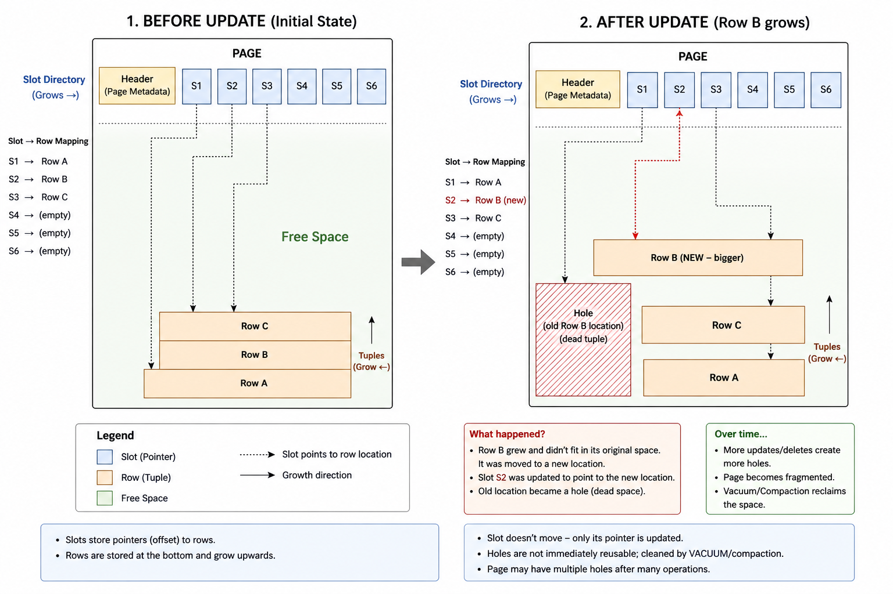

# Transaction
- Transaction: Collection of query that is treated as one unit of work.
- Every transaction start with *BEGIN* and we can *COMMIT* or *ROLLBACK* it.
- There can be multiple strategies to commit the queries, lets say we have 1000 queries in a txn -
  1. Write each query to the disk
  2. Write each query to memory and once all queries are done then update the disk
- We can also have to rollback the queries of DB crashes, so when DB comes up it must remember to rollback the data

# ACID

## Atomicity
A txn happens completely or not at all. Even if just one query fails we need to rollback all the previous successful queries.

## Isolation
Isolation controls how and when the changes made by one txn can be visible to another txn. It kinda say how much will/can you isolate multiple txn from each other.

### Read Phenomenons

#### Dirty Reads
When a txn read the uncommitted change made by another txn and this txn decides to rollback its changes. In this we have some thing which is not in the DB.
Example,

Txn A begins, set balance to 500. Txn B begin reads balance as 500 and then Txn A rollbacks. So now the balance is 1000 but Txn B has read 500.

| id  | balance |
| --- | ------- |
| 1   | 1000    |

**Transaction A**: 

```sql
UPDATE accounts SET balance = 500 WHERE id = 1; -- Not committed yet
```

Now balance (internally) is 500 but not committed.

**Transaction B**

```sql
SELECT balance FROM accounts WHERE id = 1;
```

B sees **500**.

Now A does:

`ROLLBACK;`

#### Non Repeatable Reads
If a txn reads a data multiple times and get different results because some other txn has committed their changes, this is called non-repeatable reads.
Example, 
TxnA checks balance which comes out to be 1000, TxnB starts and commits the balance to 2000. TxnA checks the balance again and finds out it 2000. But first it read the balance as 1000.

|id|balance|
|---|---|
|1|1000|

##### Transaction A

```sql
BEGIN; SELECT balance FROM accounts WHERE id = 1; -- Returns 1000
```

##### Transaction B

```sql
UPDATE accounts SET balance = 2000 WHERE id = 1; COMMIT;
```

##### Back to Transaction A

```sql
SELECT balance FROM accounts WHERE id = 1; -- Returns 2000
```


#### Phantom Reads
When a txn reads a table multiple time and the numbers of rows in the result varies because some other txn has added or removed the rows.
Example, 
Txn A check the employee table and get a row as a result. Txn B adds a new row and commits the txn. Txn A reads the employee table again and this time get 2 rows as result.

|id|salary|
|---|---|
|1|4000|
|2|6000|

##### Transaction A

```sql
BEGIN; SELECT * FROM employees WHERE salary > 5000;
```

Returns:

`id=2, salary=6000`

##### Transaction B

```sql
INSERT INTO employees VALUES (3, 7000); COMMIT;
```

##### Back to Transaction A

```sql
SELECT * FROM employees WHERE salary > 5000;
```

Now returns:

`id=2, salary=6000 id=3, salary=7000`

#### Lost Updates
When 2 txns overwrite each others changes
Example, 
Initial balance is 1000 in a DB. Txn A wants to add 500 and Txn B want to add 300. Correct result should be the balance increasing by 800. But as both the txn read the same value of 1000, they both add extra on top of 1000. So the result will be either 1500 or 1300 depending on which txn commits first. One of the txn's update will be lost.

##### Transaction A

```sql
SELECT balance FROM accounts WHERE id = 1; -- 1000
```

#####  Transaction B

```sql
SELECT balance FROM accounts WHERE id = 1; -- 1000
```

Both think balance = 1000.

#####  Transaction A

Adds 500:

```sql
UPDATE accounts SET balance = 1500 WHERE id = 1; COMMIT;
```

#####  Transaction B

Adds 300 (based on old value 1000):

```sql
UPDATE accounts SET balance = 1300 WHERE id = 1; COMMIT;
```

Final balance = **1300**

But correct balance should be **1800**

Transaction A's update is lost.

[[Write Skew|Write Skew]] - check this for more.


#### Write Skew

When 2 txn take a decision on same data and changes the data on this decision.
Example, ==On-Call Doctor problem==

|Doctor|OnCall|
|---|---|
|A|Yes|
|B|Yes|

**Transaction T1**
```sql
BEGIN;  
SELECT * FROM doctors WHERE OnCall = 'Yes';  
-- Sees A and B  
UPDATE doctors SET OnCall='No' WHERE Doctor='A';  
COMMIT;
```

**Transaction T2**
```sql
BEGIN;  
SELECT * FROM doctors WHERE OnCall = 'Yes';  
-- Sees A and B  
UPDATE doctors SET OnCall='No' WHERE Doctor='B';  
COMMIT;
```

Final state:

|Doctor|OnCall|
|---|---|
|A|No|
|B|No|

**Point to remember**:
Write skew is only prevented by serializable isolation because if serializable isolation see will either block one of the transaction or will throw an error
### Isolation Levels
Isolation levels tell how much can multiple txn can see each others update.

#### Read Uncommitted
Means that a txn can read uncommitted changes from other txn. This the weakest isolation level as it allows every read phenomenon.

#### Read Committed
Means that a txn can read committed changes from other txn. Prevents *dirty reads* as they happen because of reading uncommitted changes.

#### Repeatable Reads
Makes sure that if a txn reads a row it will see that same row throughout its txn *even if other txn modify that data*. This possible by taking snapshot. Prevents dirty and non-repeatable reads. 
May also prevent phantom reads but that depends on the database. [[Study Notes/Database/ChatGPT Responses/Response #43530632]]
Row level.

#### Serializable
It make concurrent txn behave as synchronised. It prevents all the read phenomenon. It is achieved by either heavy locking or using snapshots with conflict detection.
Full isoloation
Cons: 
1. Low concurrency(Blocking)
2. Deadlocks

#### Complete Comparison Table

| Isolation Level  | Dirty Read | Non-Repeatable Read | Phantom Read | Write Skew  |     |
| ---------------- | ---------- | ------------------- | ------------ | ----------- | --- |
| Read Uncommitted | ✅ Yes      | ✅ Yes               | ✅ Yes        | ✅ Yes       |     |
| Read Committed   | ❌ No       | ✅ Yes               | ✅ Yes        | ✅ Yes       |     |
| Repeatable Read  | ❌ No       | ❌ No                | ⚠️ Depends   | ⚠️ Possible |     |
| Serializable     | ❌ No       | ❌ No                | ❌ No         | ❌ No        |     |

#### Real World Mapping

| Use Case                               | Recommended Isolation |
| -------------------------------------- | --------------------- |
| Banking transfers                      | Serializable          |
| E-commerce checkout                    | Repeatable Read       |
| Reporting systems                      | Read Committed        |
| Analytics where minor inconsistency ok | Read Committed        |

## Consistency
Consistency ensures that after a committed transaction, the database satisfies all defined constraints. *The database transitions from one valid state to another valid state*
These constrains/rules can be any of,
- Primary key constraints
- Foreign key constraints
- Unique constraints
- Check constraints
- Triggers
- Application-level invariants
- Business rules

|Account|Balance|
|---|---|
|A|1000|
|B|500|

Business rule:

- Total money must remain same.
- No negative balance.

Transaction:

```sql
BEGIN;  UPDATE accounts SET balance = balance - 200 WHERE id = 'A'; UPDATE accounts SET balance = balance + 200 WHERE id = 'B';  COMMIT;
```

After commit:

| Account | Balance |
| ------- | ------- |
| A       | 800     |
| B       | 700     |

Total = 1500 (same as before)

**If crash happens midway**
Suppose:
- Money deducted from A
- Crash happens before adding to B

Now:

| Account | Balance |
| ------- | ------- |
| A       | 800     |
| B       | 500     |

Total = 1300 ❌

That violates business rule.
Refer [[Constraints]] for more examples on Consistency


## Durability
Ensures that if the transaction is committed the data is not lost in any case (server crash, power outage, OS crash)

Database ensures Durability using *Write Ahead Log* (WAL).

### WAL
Changes are written to a log in the disk before they are applied to actual data pages. 
The transaction writes data to memory(RAM), at the time of commit changes are pushed to log file. Data pages maybe written later.

Problem with WAL is that when DB asks OS to write data/changes to log file the OS stores the data/changes to OS cache and returns that the data has been saved successfully. If at this point OS crashes the changes wont be written to log file.

To prevent this DB uses *fsync* method which writes the data/changes directly to the file and is thus responsible for *slower commits*.


# Table Structure

Database stores data in *fixed size* blocks called pages. Each page `n` byte long depending on the database being used.
Example, Postgres has *8 KB* pages.

An empty page has page header which has a prefixed size, example 10 byte.
```
Page Layout
+---------------------+
| Page Header(10btyes)|
+---------------------+
|                     |
+                     +
|                     |
|Free Space(8182bytes)|
|                     |
+                     +
|                     |
|                     |
|                     |
+---------------------+
```

Inside a page everything is identified by byte offset. So if we want to refer a row we give the offset for that row.

Example, 

```sql
RowA -> offset 7600
```

## Problem with byte offsets

If we use byte offset indexes will also have to use byte offset.
Indexes refer to page number and the row offset, example,

```sql
IDXA -> (Page 5, Offset 7600)
```

This means that value `IDXA` is present at page 5 and the row starts at byte 7600.
If something happens and the row shifts to some other byte offset because of it being updated or other rows being deleted the offset in the index wont change and now the index will still point to same Offset(i. e 7600)
To solve this problem database came up with *slots*.

## Slot

Slot is part of the page.  Each slot points to a offset in the page. And now every row is referred by the slot where it is present and not the offset.
Example, 
```
SlotA -> 7600
SlotB -> 7800

RowA -> SlotA
RowB -> SlotB
```

Similarly now index also point to slots and not offset.

```sql
IDXA -> (Page 5, SlotA)
```

```
+----------------------+
| Header               |
+----------------------+
| Slot 0 → Row A       |
| Slot 1 → Row B       |
| Slot 2 → Row C       |
+----------------------+
|      Free Space      |
+----------------------+
| Row C                |
| Row B                |
| Row A                |
+----------------------+
```


### How will slot help?
Without slot if we move a row we won't know where it went and will have to search it, maybe again and again. But with slot we always store row address in the slot and row can anywhere.

### What happens if a row is updated with a larger data?

> When a row grows during an update, it may not fit in its original location, so the database writes it elsewhere and updates the slot pointer. The old location becomes dead space, creating fragmentation(hole) inside the page.
> 


# Database indexes

**Sequential Scan**: Reading all the rows in the table. Fast when the table is small. Example, 
```sql
select * from table_name;
```

**Index Scan (Random Scan)**: First the DB checks the index and then it goes to exact row. *Can be slow if there is lot of data*. ^idxscan

#### Sometimes Sequential Scan is preferred even on indexed columns
Example table,

| id  | name  | grade |
| --- | ----- | ----- |
| 1   | Alice | 3     |
| 2   | Bob   | 4     |

This is table of students and their grades. Grades range from 1 to 10 and this table has 1 million rows. Indexed on `id` and `grade`

The first query is,
```sql
select * from student where grade = 3;
```
In this case the student with `grade` 3 are going to be few (compared to the 1 million) lets say 10000.
The DB knows this and searches using index because the number of rows are low.

Lets take another query,
```sql
select * from student where grade != 3;
```
In this case the DB know that the numbers of rows are huge and almost equal to 1 million. In this case doing a index scan will be slow as it is random access. So it is *better to do full table scan*.

#### 2 types of index scan

**Index Scan**: Same as [[#^idxscan]]


**Index Only Scan**: All the data is in the index and DB does not have go to fetch more data. Example, If we need anything other than index in the `select` query the DB performs *index scan* as we need data other than index which will required DB to fetch page and slot.


#### Bitmap Scan
Rather than doing random scan when using idexes, DB marks the rows where the data is present *(row that passes the where clause)* using a bitmap
```
1 2 3 4 5 6 7 8 9
1 1 0 0 1 0 1 1 0
```
This show that row `1,2,5,7,8` passes the condition and others don't.
Once this bitmap is created DB does a **near-sequential** scan.

1. DB needs to fetch almost all the rows -> Sequential Scan
2. DB needs to fetch less rows -> Index / Index Only Scan *(if index is present)*
3. DB need to fetch mid amount of rows -> Bitmap Scan

**Bitmap Combination Scan**

When a `OR` or a `AND` condition is used in a query the DB make bitmap for all the condition and take a `OR` or a `AND` operation on the bitmaps. Example, 
```sql
-- Bitmap A
1 2 3 4 5 6 7
0 1 1 0 0 1 1
```

```sql
-- Bitmap B
1 2 3 4 5 6 7
1 1 0 0 1 0 0
```

Result - lets say `OR`

```sql
-- ORing A and B
1 2 3 4 5 6 7
1 1 1 0 1 1 1
```

DB then does a **Bitmap Heap Scan** which similar to *Sqen Scan*, just that Sqen Scan scans the entire table but Bitmap Heap Scan only scan the relevant  rows.


#### Why does condition recheck happens?

This happens because Bitmaps are *lossy*.
**Lossy**: Bitmap marks pages and not rows, so for example if index looks something like this,
```txt
id_idx | (page, slot)
1   | (1, 3)
2   | (1, 4)
3   | (4, 6)
4   | (9, 5)
.
.
.
```

In this case bitmap will store

```txt
page | condition valid
1    | passes (this page pass the condition and might have some data)
2    | passes (this page pass the condition and might have some data)
3    | passes (this page pass the condition and might have some data)
.
.
.
```

Now this is just the case with `id_idx`, this a same `page | condition valid` bitmap will be generated for `grade_idx` also.

Once the pages are finalised using but `ANDing` or `ORing` the bitmap DB still does not know which rows in those pages actually satisfy the both conditions *(a page will have multiple rows)*. Example,

**Condition: id > 12 and grade != 3** 
```
Page 5
Row 1200 -> (id : 12, grade = 3, name : A) ❌
Row 1201 -> (id : 12, grade = 4, name : B) ✅
Row 1202 -> (id : 13, grade = 5, name : C) ❌
Row 1203 -> (id : 12, grade = 6, name : D) ✅
.
.
.
```

Only row `1201` and `1203` are satisfying both the conditions.

#### Key VS Non-Key Indexes
**Key index** - values for these indexes are unique, example `id`, `order_id` etc
**Non-Key Indexes** - values for these might not be unique, example `gender`, `city`, `grades`

Key index store just one tuple *(page, slot)*, while a non-key index stores list of tuples

#### Include Index
```sql
create index something_idx on table_name (column1) include (column2);
```
Just attach a column with an index. Example, 
```sql
(grade, name) -> (pageId, slotId)
(1, "A") -> (page1, slot3)
(2, "B") -> (page3, slot4)
(4, "X") -> (page2, slot8)
.
.
.
```
In this case if a query searches for `name` and puts condition on `grade`, then DB can get the `name` directly from the index, so in this case DB will do `Index Only Scan`.

If the index did not include `name`, then DB will do `Bitmap Scan`

#### Composite Index
Index which is created on multiple columns.
If the application has lots of `AND` queries on `n` columns then composite index are very fast.
Example, 
```sql
select some_column from student where a = 10 and b = 30;
```

A composite index on `a` and `b` will be very fast.

# Concurrency


