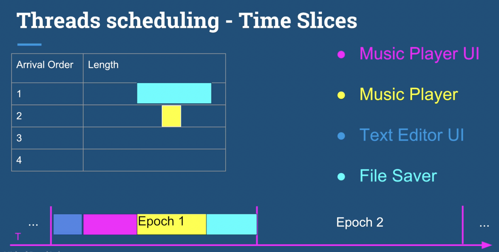
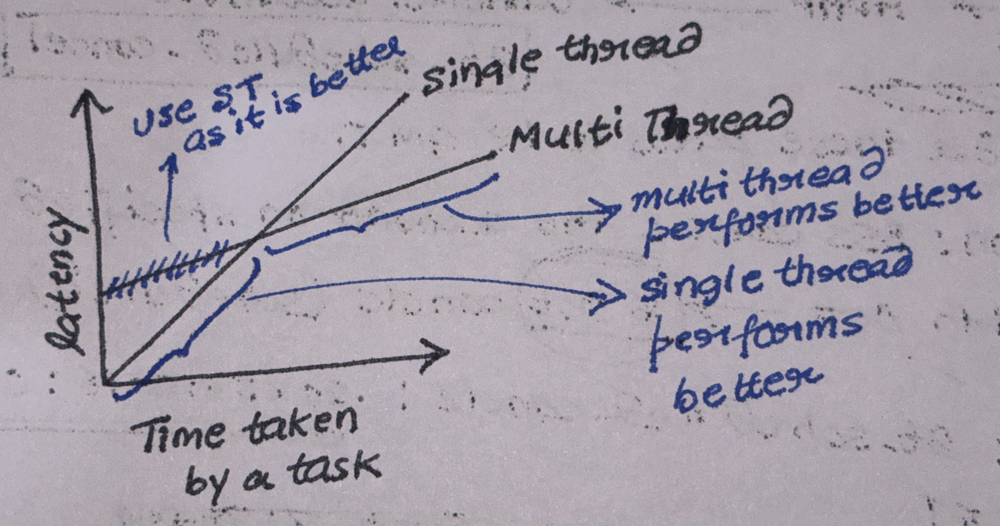
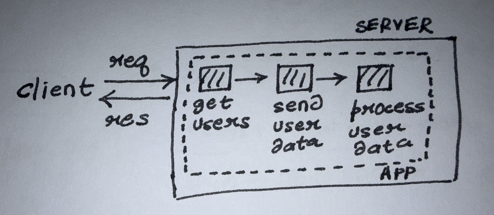

## Fundamentals

* Thread scheduling : OS schedules threads using epochs. The decision to execute hoe much of a thread (10% in this Epoch
  or
  40% in this epoch) is taken by `Dynamic Priority`.
* Epochs :



* `Dynamic Priority` = `Static Priority` + `Bonus`
* `Static Priority` : Set by developer before the application starts.
* `Bonus` : Given by operating system for each thread depending on which threads did not get enough time to complete in
  last epoch to prevent starvation. `Bonus` can be negative.

* [Uncaught exception in thread example](../../Code/src/com/cpo/ThreadException.java)

* Thread consumes resource in kernel even when it is not running.
* App will not stop if any thread is running even when main thread has stopped.
* We need to stop a thread when:
    * Thread is misbehaving.
    * When task is over and we have to cleanup by stopping all the thread.

* Deamon thread : When a thread needs to run in the background irrespective of if the main thread is stopped or not
  are called Deamon thread. They can be interrupted.
* [Examples on thread interruptions](../../Code/src/com/cpo/ThreadInterruption.java)

## Performance Optimisation

* Latency : Time required to do a task. Measured in `time unit`
* Throughput : Number of tasks completed in a certain period of time. Measured in `tasks/time unit`
* Latency can be reduced by dividing the task into `N` subtask and using threads to perform each subtask.
* In normal computer number of threads should be equal to number of cores in the system.
* When *to* and *not to* use multi threading :



* As per the above graph, when single thread is used `Time taken by a task = Latency`,
  but in case of multi threading when the params are less (time taken by the task is less) the latency might be poorer than single thread *as we are adding extra overhead of creating multiple threads* and when the number of params increase (time taken by the task increase) the latency reduces in comparison to single thread.

##### Question
A application is performing a **blocking call** to a server using a thread pool. If the machine on which app is running is having `n` cores what is optimal number of threads in the pool.
*Answer* : In this case the answer will be `n`. The application is making a blocking call, that mean the thread are waiting for the response. ==Because of waiting the CPU is ideal==. If CPU is ideal we can create more threads and put them to work. So, we can have more that `n` threads.  

##### Throughput Optimization
Maximising the number of tasks performed in a unit time.
Ways to optimise throughput:
1. Reduce bottlenecks like slow DB queries, blocking I/O calls, locks.
2. Optimised thread-pool size, too few threads -> not utilising CPU fully, too many thread -> CPU is wasted in context switches.
3. Don't use locks like `synchronize` too often, use concurrent collection.
4. Execute things in batch if possible, 1000 row updated at once rather that call DB 1000 times.
5. Reduce GC pressure -> If GC starts the app is paused lowering the throughput, so try to use same object and primitives + avoid unnecessary boxing/unboxing.

##### Latency Optimization
Minimising time taken by a task to complete.
Ways to optimise latency<sup>(not adding all the approaches as some are similar to throughput optimisation approach)</sup>:
1. Avoid multiple calls to DB
2. Optimise algo *(Example `O(n^3)` -> `O(nlogn)`)*
3. Avoid blocking calls, instead use something like `Future`
<span style="color: red; font-weight: bold">Note: This app is single threaded</span>


Sometime Throughput depends on Latency and sometimes not. Reducing Latency is one of the many methods to increase Throughput.
Here is an example,
There is a application which gets `n` users from the DB like this,

**Stage 1** - Unoptimized Latency
<table>
    <tr>
      <th>Method</th>
      <th>Time taken</th>
    </tr>
    <tr>
      <th>Get N Users from DB</th>
      <th>Slow(N calls to DB) -> 1 sec</th>
    </tr>
    <tr>
      <th>Send user data to a 3<sup>rd</sup> party service</th>
      <th>Slow(Blocking HTTP call) -> 2 sec</th>
    </tr>
    <tr>
      <th>Process the user data</th>
      <th>Slow O(n^3) -> 1 sec</th>
    </tr>
  </table>

We can see the latency is slow here.
==Latency = (1 + 2 + 1) = **4** sec==
==Throughput = **1/4** request/sec==

**Stage 2** - Optimizing Latency
1. Optimized DB calls by making just 1 call rather than `N`
2. Optimized blocking calls by using async calls *(like Futures)*
3. Optimized Processing algo from `O(n^3)` -> `O(nlogn)`
<table>
    <tr>
      <th>Method</th>
      <th>Time taken</th>
    </tr>
    <tr>
      <th>Get N Users from DB</th>
      <th>Fast(1 call to DB) -> 0.5 sec</th>
    </tr>
    <tr>
      <th>Send user data to a 3<sup>rd</sup> party service</th>
      <th>Fast(Async call) -> 1 sec</th>
    </tr>
    <tr>
      <th>Process the user data</th>
      <th>Fast O(nlogn) -> 0.5 sec</th>
    </tr>
  </table>

Latency has improved and so is throughput
==Latency = (0.5 + 1 + 0.5) = **2** sec==
==Throughput = **1/2** request/sec==

**Stage 3** - Improving Throughput *even when latency cannot be improved more*
1. Optimization **#1** - We can increase threads from 1 thread to 10 threads
   ==Latency = (0.5 + 1 + 0.5) = **2** sec==
   ==Throughput = **10 x 1/2** request/sec = **5** request/sec==
2. Optimization **#2** - We can scale up server. Instead of having 1 server we will now use 10 servers.
   ==Latency = (0.5 + 1 + 0.5) = **2** sec==
   ==Throughput = **10 x 10 x 1/2** request/sec = **50** request/sec==

## Synchronisation
[[Concurrency-1.pdf]] - check this
`synchronize` is **Reentrant**. This means,
```java
class A{
	void foo(){
		sync(obj1){
			// logic
			bar();
		}
	}
	
	void bar(){
		sync(obj1){
			// logic
		}
	}
}
```
If a *threadA* is inside `foo`, `bar` will also be locked. If *threadA* tries to enter `bar` it will be allowed entry, but if another thread *threadB* tries to access any method `foo` or `bar` it will not be allowed to enter until *threadA* release lock.

### Atomic Operations
1. All reference assignment are atomic. Example,
```java
   Object a = new Object();
   Object b = new Object();
   a = b // atomic
   ```
This implies all getter and setter operations are also atomic
2. All assignment to primitives are atomic except `double` and `long` as they are 64 bit long.
3. For `double` and `long` assignment to be atomic we can use `volatile` keyword.
4. Classes under `java.util.concurrent.atomic` have lock free operation.


### Happens-Before
[[DataRace.java]] is a perfect example on happens-before.
In this example we have a method,
```java
void incr(){
	x++; // double
	y++; // double
}
```
and a method,
```java
void check(){
	if(y > x) print("y > x");
}
```
Now both of these method are called in a loop by a ==individual single threads== *i.e.* `incr` is called by `t1` thread only and `check` is called by `t2` thread only.
In this case no matter where we context switch `t1` it can never happen that `y` > `x`, but still `t2` thread prints that `y > x`. This shows that Java compiler is executing instructions out of order *(but make sure logic is intact)* this called **happens-before**.


## Locking
#### Coarse Grained Locking: 
When we lock multiple methods or maybe the entire class. *All the locks the taken on `this` object.*
**Pros**: Easily managed
**Cons**: If used excessively it is as good as using a single thread.
Example, 
```java
class A{
	public sync void fooA(){....}
	public sync void barA(){....}
	public sync void fooB(){....}
	public sync void barB(){....}
	.
	.
	.
	.
}
```

#### Fine Grained Locking
When we lock methods on different monitor.
**Pros**: Allows more parallelism
Example, 
```java
class A{
	private Object lock1 = ...
	private Object lock2 = ...
	
	public void foo(){
		sync(lock1){
			// logic		
		}
	}
	public void bar(){
		sync(lock2){
			// logic
		}
	}
}
```
As per above example, 2 threads can simultaneously access `foo` and `bar` plus and acquire lock on these methods.

#### Deadlock
Happens when multiple threads are waiting for shared resources, and no thread is giving up already acquired resource required by other thread.
Example, We have 2 resource `A` and `B`

**Thread 1**
```java
lock(A);
lock(B);
// critical section
release(A);
release(B);
```

**Thread 2**
```java
lock(B);
lock(A);
// critical section
release(B);
release(A);
```

Lets say *Thread-1* acquire lock on resource `A`, context switch happens and control comes to *Thread-2*, this thread acquire lock on resource `B`. When tries to acquire lock on `A` it find that this resource is already locked and it goes in suspended state. Controls goes back to *Thread-1*, it tries to acquire lock on `B` but finding it is already locked goes in to suspended state. No thread can do any work.

##### Conditions for deadlock
1. There should be at least one resource that non-shareable. Example, printer is a resource which can be used one at a time. This called *Mutual Exclusion*
```java
sync void usePrinter(String str){...}
   ```
2. Thread should be holding at least one resource and waiting to acquire another resource, called *Hold & Wait*
3. A cannot be taken forcefully from any thread, called *No Preemption*.
4. A cycle of threads exist where each thread wait for a resource locked by next thread, called *Cyclic Wait*

###### Deadlock Solutions
1. If shared resources to be locked are less we should try to maintain same order in which the locks are acquired.
   **Thread 1**
```java
lock(A);
lock(B);
// critical section
release(A);
release(B);
```

**Thread 2**
```java
lock(A); // acquire A first
lock(B);
// critical section
release(B);
release(A);
```
Here we are acquiring lock on resource `A` first. *Thread-1* will acquire lock on `A`, when *Thread-2* tries to acquire lock on `A` it wont be able to and *Thread-1* will also acquire lock on `B` thus avoiding deadlock.

2. Watchdog, thread interruption, tryLock (Check online)

## Advanced Locking
### ReentrantLock
It is similar to `synchronize` keyword. The only complication is that this lock needs to be unlocked/released manually. Example, 
```java
Lock lock = new ReentrantLock();

void foo(){
	lock.lock();
	bar(); // critical section
	lock.unlock() // manual unlock
}
```
In case of an exception we wont be able to unlock, so unlock should be done in a finally block.
```java
Lock lock = new ReentrantLock();

void foo(){
	lock.lock();
	try{
		bar(); // critical section
	}
	finally{
		lock.unlock() // unlocking inside finally so as to release the lock even in case of an exception.
	}
}
```

We get some extra methods with this lock,
1. `lockInterruptibly()` -> method allows a thread to wait until it is interrupted. This can avoid deadlocks. Example,
```java
void foo(){
	lock.lockInterruptibly();
	// logic
}

Thread t1 = new Thread(() -> foo());
t1.start();
t1.interrupt(); // the thread will stop waiting (if waiting) and release the lock.
```

2. `tryLock()/tryLock(timeout, unit)` -> method will try to acquire the lock, if the lock is already acquired by any other thread this method returns `false`  if not *then it will acquire the lock + return `true`*. 
	1. `tryLock()` -> **non-blocking**
	2. `tryLock(timeout, unit)` -> **blocking for specified time**

**Imp:**
Reentrant lock also provided fairness.
If there are plenty of threads in line to acquire a lock and certain thread somehow is acquiring the lock everytime the other threads will starve. This is unfair. 
With Reentrant lock we set fairness to `true`, `Lock lock = new ReentrantLock(true)` this will makes sure every thread gets a chance to acquire the lock.
The threads will execute in order, first come first serve basis, this will reduce the throughput of the application, read more [[Response 1]].

### ReentrantReadWriteLock
Provides 2 locks. Read lock allows multiple threads and write only allows single thread at a time. If atleast one thread has acquired read lock another thread cannot acquire write lock. If a thread have acquired write lock no thread can acquire read lock.
