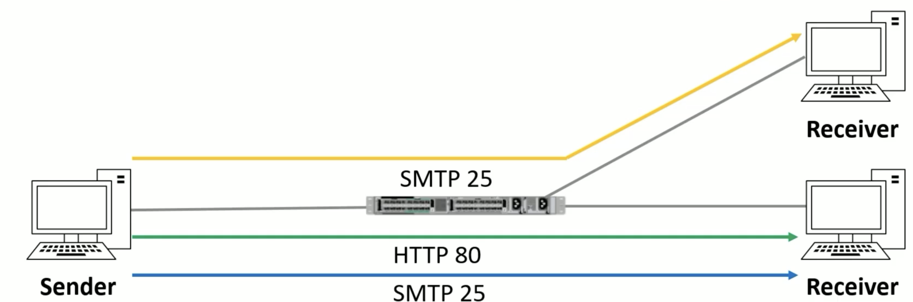
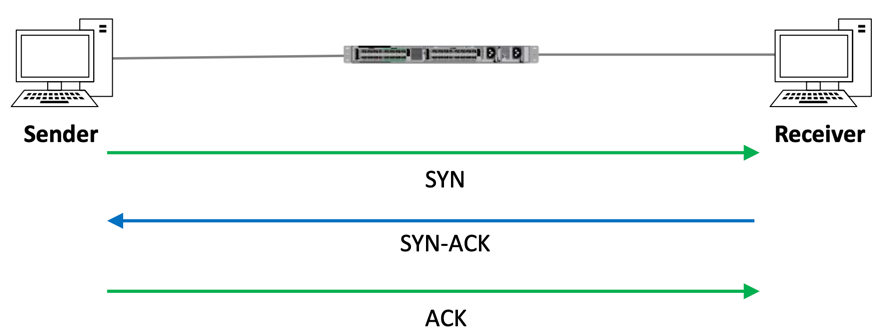
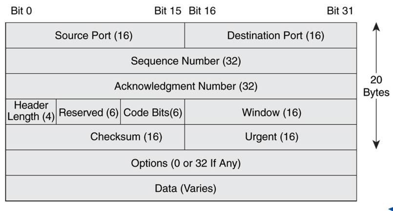
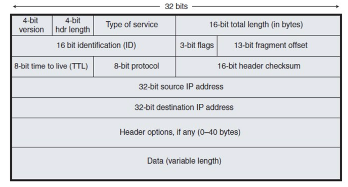
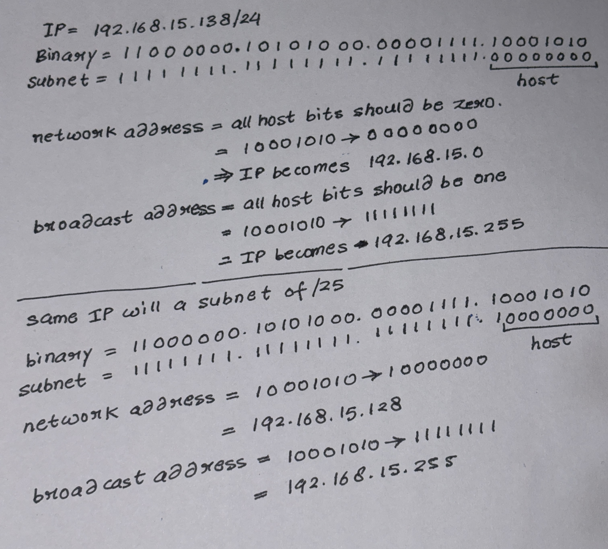
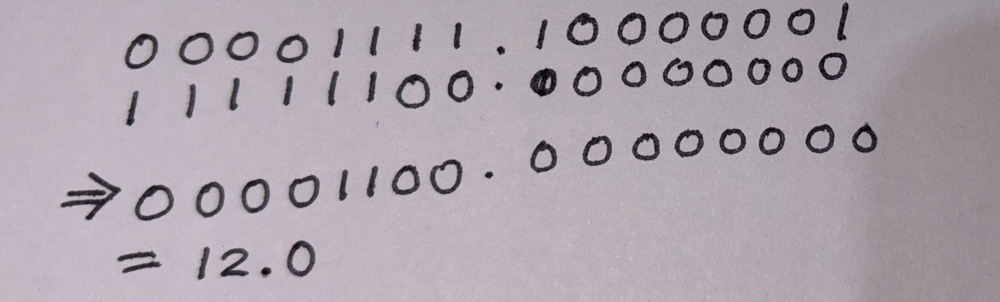
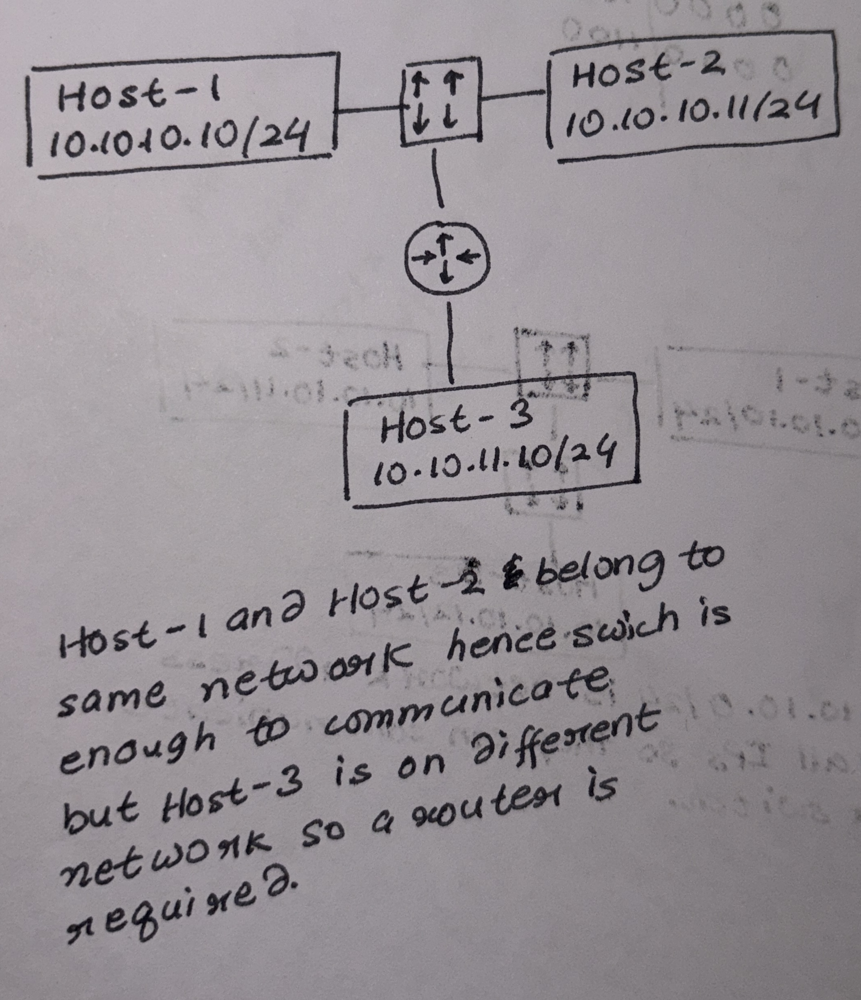

							
* PDU : Protocol Data Units, block of data shared between different layers of OSI or TCP/IP models.
* Here is what its called at each layer,

- Upper OSI Layer:
    1. Includes -> Application, Presentation, Session.
    2. Application layer is the app itself, the UI that we see. HTTP/S is a app layer protocol.
    3. Presentation layer is responsible for translation and encryption. SSL is presentation layer protocol.
    4. Session layer manager, establishes session b/w 2 hosts.

* Lower layer OSI Layers:
    1. Transport layer : Ensure data delivery, breaks data into segments and handle port numbers.
       TCP/UDP are used here. Like a delivery service ensuring your packages to the right destination intact.
    2. Network layer : Encapsulate segment into packet and IP address to them, finds path(route) to send
       these packets. Router works on this layer. Sending from India -> USA, packets travel across multiple
       routers. Like choosing best road to a destination.
    3. Data link layer : Frames packets, add MAC address (src/dest). Ethernet, WiFi work on this layer.
       Laptop send frames to WiFi router, frames contain WiFi's MAC address. Like street names and
       house number used for delivery
    4. Physical layer : Converts frames into signals. Responsible for data rate. Optical fibers, Hubs.
       Like roads and wires.

  ## Transport Layer (4):

    1. Responsible to data transfer between hosts
    2. Responsible for flow control.
        * Flow control : If receiver or send are too fast or too slow this layer controls the flow of data
          so that none of the side get overwhelmed
    3. Responsible for session multiplexing.

       

        * Session Multiplexing : using a single network connection (or session) to handle multiple communication
          streams simultaneously between two devices or applications.
        * Analogy : Highway - One connection | Lane - Multiple communication stream
        * Without multiplexing every application needs to open a new connection, example, new connection for each tab
          , new connection for chat app etc
        * Multiplexing offers :
            - Reduced connection overhead
            - Optimized resource usage
            - Improved performance
        * Sender sends message with destination and soruce port, example, `DST:80 SRC:1500` when the receiver sends
          the traffice back it flips destination and soruce.
        * TCP:
            - Once a connection is established data can be send bidirectionally.
            - Carries sequencing to ensure packets are received in correct order
            - Lost segment are resnet after an acknowledgement is received.
            - Performs flow control.
        * TCP 3-way handshake:

        

        * TCP headers:

        

        * UDP:
            - It is not connection oriented(does not performs handshake).
            - Doesnt carry seq number, doesnt care is if data is received or lost.
            - Not reliable.
            - Does not perform flow control.
            - If error detection and recovery is required upper layers should provide it.

        * UDP Header:

        

        * Real time traffic uses UDP.
        * DNS uses TCP and UDP.

  ## Network Layer (3) :

    * Route packets to their destination.
    * No connection protocal, i.e. no handshake/ack is done.
    * Protocol on this layer : IP, ICMP, IPSec.
    * IP Header :

    

    * Types of traffic :
        * Unicast : One-to-One communication. If multiple request comes then multiple copies of same will have to
          send to each receiver. Good for private communication.
        * Broadcast : One-to-All communication. One message is send to everyone on the subnet. Routers do not
          forward boradcast messages. Comes in use with DHCP server (google this).
        * Multicast : If we have to send message to multiple receiver using Unicast it will lot of bandwidth
          , directly propotional to number to receiver. But with multicast, sender just have to send one which
          gets distributed to all the interested receiver.

    * If a packet is going from sender to receiver on same subnet it can go directly(via switch). If sender and receiver
      are
      on different subnets then it has to go through router.
    * IP address is 32 bit long. Written in 4 section of octets. Example, 127.34.56.102
    * IP is set manually on servers, routers and other network devices. For devices like PC and laptop the IP is
      automatically assigned using DHCP.

  ## IP Classes
  
  ### Class A IPs:

    * Used where large number of host are needed.
    * Subnet of 8.
    * First bit is always zero. Example, *0*0011011.11011010.11001010.01011010 is a Class A IP.
    * If the first bit is zero the network range reduces to (0-127).0.0.0
    * 0 cannot be start of a IP and 127 is reserved for local, so now the address ranges reduces to (1-126)
    * 127.0.0.1 - 127.255.255.255 are all reserved for loopback testing (local).

  ### Class B IPs :

    * Used for mid to large size networks
    * First 2 bits are 10.
    * Subnet 16
    * Range 128.0.0.0 - 191.255.0.0

  ### Class C IPs :

    * Used for small size networks.
    * Starting bits are 110.
    * Subnet 24
    * Range 192.0.0.0 - 223.255.255.0

  ### Class D IPs :

    * Reserved for multicast address.
    * First 4 bits are 1110
    * These address are not allocated to host and there is no subnet mask
    * Range 224.0.0.0 - 239.255.255.255

  ### Class E IPs :

    * First 4 bits are 1111.
    * Kept for experimental and future use.
    * Range 240.0.0.0 - 255.255.255.255
    * 255.255.255.255 is a broadcast address.

* Private IP address :
    - Class A: 10.0.0.0 to 10.255.255.255
    - Class B: 172.16.0.0 to 172.31.255.255
    - Class C: 192.168.0.0 to 192.168.255.255

## Subnetting

- Subnet is always a series of `1`s followed by a series on `0`s.
- This `1` portion defines *Network section* and the `0` portion defines *Host portion*.
- We represent a subnet with `/<NUMBER OF 1s>` notation. Example, `192.168.15.20/21` means first 22 bits on this network are one and rest are zero.
- Example: `192.168.15.138/24` 

- Correct way to represent a network is to make all its host bits zero. 
  Example, 
  Incorrect network representation: `192.168.15.129/22`
  Correct network representation: `192.168.12.0/22`
- Explanation:   `192.168.15.129/22` -> `...|..|00001111.10000001`, subnet is `...|...|11111100|00000000` so all bits starting from 23rd should be 0 in the network. Which gives us `192.168.12.0`. 
- 2 IPs are in same subnet if there network address is same. Example,  
  IP 1: `10.10.10.10/24`
  IP 2: `10.10.10.11/24`
  Both the IPs have network address of `10.10.10.0` so they belong to same subnet.
#### Dividing a network in subnets
We can divide a larger network in smaller subnets. For example, `192.168.15.0/24` can be divided into **8** subnet by using `/27` 

### CIDR - Classless Inter-Domain Routing
- ==Replaced old Class based IP division==
- If a company needs to allocate, lets say 300 than rather that going with `class C` IPs company will have to be assigned `class B` IPs. `Class B` IPs has a subnet of `/16` which means an IP will look something like this, `[ASSIGNED].[ASSIGNED].[VARIABLE].[VARIABLE]`, example `192.30.0.0` this last 2 value can be anything between 255. Example, `192.30.1.1`, `192.30.1.2`, `192.30.1.3`.... `192.30.2.1`..... and so on, => ==***255 \* 255 = 65025***== IPs and the company only had to assign 300 IPs. ==This a wastage of addresses==. Thus we came up with CIDR which lets the company divide IPs in any subnets they want.
- So for a company that needs 300 IPs, they can have something like `192.30.128.0/23` this will give us IPs in ranges `192.30.128.[0...1].[0...255]` => around 500 IPs, *fewer IPs are wasted*.

### Variable Length Subnet Mask(VLSM)
To understand VLSM first lets see what is *Fixed Length Subnet Masking(FLSM)*. Example, A company has been assigned a Class C network `192.168.15.0/24`. This company needs to assign `n` IPs to different departments as follows,
<table>
    <tr>
      <th>Department</th>
      <th>Number of IPs needed</th>
    </tr>
    <tr>
      <th>A</th>
      <th>100</th>
    </tr>
    <tr>
      <th>B</th>
      <th>50</th>
    </tr>
    <tr>
      <th>C</th>
      <th>25</th>
    </tr>
  </table> 
FLSM says that we will distribute `MAX(number od IPs)` to everyone, in this case `MAX(100, 50, 25) = 100`
This subnet required to do this should accommodate 100 host address at least. How bits are required to make 100? 27 = 128 which is close to 100. So we will require 5 bits from the end.
We will have subnet it using `/25` as 32-25 = 7. This will just 2 subnet of 128(*126 usable*) IPs. We are short of Subnets(required 3) and wasted IPs.
VLSM let us subnet the IPs flexibly as we don't need to divide the IPs equally.
100 IPs -> `192.168.15.0/25`
50 -> `192.168.15.128/26` *(as IPs `192.168.15.[0-127]` is used by department A)*
25 -> `192.168.15.192/27`

==*In VLSM wastage is lesser compared to FLSM*==.

### Private Address
- Addresses which are not connected/reachable by the internet.
- Secure and cheap.

<table>
    <tr>
      <th>Class</th>
      <th>IP range</th>
    </tr>
    <tr>
      <th>A</th>
      <th>10.0.0.0/8</th>
    </tr>
    <tr>
      <th>B</th>
      <th>172.16.0.0/12</th>
    </tr>
    <tr>
      <th>C</th>
      <th>192.168.0.0/16</th>
    </tr>
  </table>

- As private IPs are not connect to the internet 2 host in different private network can have same private IPs.

### IPv6
- IPv4 has small range, so we ran out of address.
- IPv6 is 128 bit where as IPv4 is 32 bits. 

### Network Address Translation
Lets multiple private IPs to access internet using a single public IP. Example, If company is having 200 private IPs/hosts and if these hosts want to access internet they will require 200 public IPs to do so without NAT, with NAT they can use a single public IP.
*This saves cost*.

##### How does NAT solves the problem of limited IPv4 IPs?
As mentioned above for 200 private IPs, if they all want to connect to the internet, we will require 200 public IPs. But with NAT will might only required 1 public IP.

## Data Link Layer (2)
Encode-Decode frames to bits. Ethernet is used here.

1. Preamble: Help sender and user to synchronise
2. Des/Src Address: Is usually MAC address when using Etherner
3. Ethertype - Usually IPv4
4. FCS: Frame Check Sequence, used to check nothing is corrupted

### Mac Address
MAC stands for *Multimedia Access Control*. ==Hexdecimal==. It is a 48-bit long address. First 24-bits are provided by the manufacture *(OUI - Organisationally Unique Identifier)* and the next 24-bit is vendor specific. Globally unique. Example, `00:50:56:C0:00:08`

## Physical Layer (1)
Transfers stream of bits via *Electric signals, Light Signals etc*
### Type of Ethernet Cables
3 types of ethernet cables

#### Coaxial Cable
Old and obsolete technology. Single copper wire.

#### Twisted Pair Copper Cable
Most commonly used. As the wires are twisted it prevent electro-magnetic interference.

#### Fiber Optic Ethernet
Uses ==light instead of electrical signals==.  Immune to electromagnetic interference. Used in ==data centers & ISPs==.

## Devices
1. **Collision Domain**: Network segment where all device share same communication medium. *TL; DR only one device can transfer data at a time, can cause of this collision might occur.*
2. **Half-Duplex**: All port have one collision domain, so only one host can transmit data at a time.
3. **Full-Duplex**: One collision domain per port so all the host can send and receive data at same time.

### Hubs
Helps host attached to it communicate. Operate on Half-Duplex. Hubs operate on *Layer 1* so they are not aware of MAC address, as a result when a frame is received it is flooded to all port except the one it received on. Hampers performance as all the host have to process them.

### Switch
Helps host attached to it communicate. Similar to Hubs. Can operate on Half or Full Duplex.
Usually operate on Full-Duplex. Operate on *Layer 1 and 2* so it is MAC address aware. When a frame is received switch checks for the MAC address and sends it just to the port it is supposed to go to. ==If a frame is received for broadcast or for a unknown destination it is flooded to all the ports==.
Check [[11-03 Switch Operation.pdf]] first slide.
When host with MAC address `1.1.1` wants to send frames to host with MAC address `2.2.2` it first sends it to switch. Switch sees that this MAC address is coming to port 1 of the switch and stores it into the table.
<table>
    <tr>
      <th>MAC</th>
      <th>Port</th>
    </tr>
    <tr>
      <th>1.1.1</th>
      <th>1</th>
    </tr>
  </table>
Switch sees that destination MAC `2.2.2` is *not* present in this table, it an unknown MAC so it broadcasts it to all the host except the one it came from. Host with MAC `2.2.2` processes this confirm as that it's MAC is equal to the destination MAC and send a reply and will hit switch on port 2, switch will store this.
<table>
    <tr>
      <th>MAC</th>
      <th>Port</th>
    </tr>
    <tr>
      <th>1.1.1</th>
      <th>1</th>
    </tr>
    <tr>
      <th>2.2.2</th>
      <th>2</th>
    </tr>
  </table>

### Router
Route traffic from one network to another. Work on Layer 3 so they are IP aware. Example,

>When data travels over the Internet, routers use the **destination IP address** to forward packets from one network to another until the destination network is reached. Once the packet reaches the destination local network, the **switch uses the destination MAC address** to deliver the frame to the correct host within that network.

## Life of a Packet
