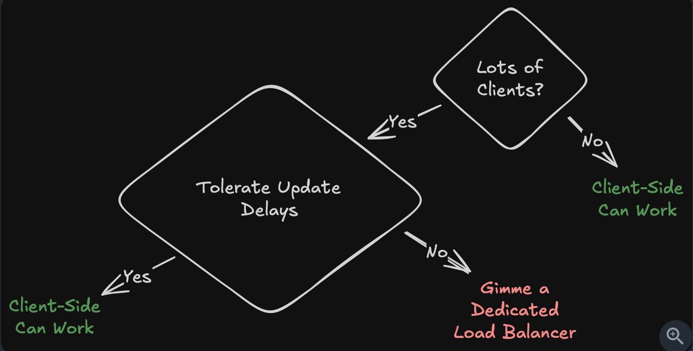

# Network

## General Points

- When to use UDP over TCP:
  1. Low latency is very important
  2. Some packet loss is acceptable
  3. Handling high volume telemetry log where occasional loss is fine
  4. You don't need support of web browser ==(cause browser don't have widespread support for UDP)==
- Use SSE when you want the client to have an update as soon as the event occurs. Example, Bidding applications.
- When we send data via SSE some old proxies might start buffering the data until all the data is received rather than sending the data to the client in chunks. Read [[Problem with SSE]]
- NAT device is basically router.
- Router usually has 2 interfaces one with private IP *(like 192.168.0.x)* and one public IP that eventually connects us to the internet *l(ike 49.207.210.28)*
- Websockets are to be used when we need high-frequency, bi-directional and persistent comm b/w client and server, example Games, Messaging apps.
- WebRTC is used when Audio/Video conferencing is involved *(or maybe in collaborative editors like GoogleDoc)*

## TCP vs UDP

| Feature            | UDP                     | TCP                    |
| ------------------ | ----------------------- | ---------------------- |
| Connection         | Connectionless          | Connection-oriented    |
| Reliability        | Best-effort delivery    | Guaranteed delivery    |
| Ordering           | No ordering guarantees  | Maintains order        |
| Flow Control       | No                      | Yes                    |
| Congestion Control | No                      | Yes                    |
| Header Size        | 8 bytes                 | 20-60 bytes            |
| Speed              | Faster                  | Slower due to overhead |
| Use Cases          | Streaming, gaming, VoIP | Everything Else        |

==QUIC - Consider it a better version of TCP==

## Common Status

- Success (2xx)
    - 200 OK: The request was successful
    - 201 Created: The request was successful and a new resource was created
- Moved (3xx)
    - 302 Found: The requested resource has been moved temporarily
    - 301 Moved Permanently: The requested resource has been moved permanently
- Client Error (4xx)
    - 404 Not Found: The requested resource was not found
    - 401 Unauthorized: The request requires authentication
    - 403 Forbidden: The server understood the request but refuses to authorize it
    - 429 Too Many Requests: The client has sent too many requests in a given amount of time
- Server Error (5xx)
    - 500 Server Error: The server encountered an error
    - 502 Bad Gateway: The server received an invalid response from the upstream server


## What is TLS?

==Complete this note!!!!!!!==

## GraphQL

- Under-fetch: Fetching lesser data than required
- Over-fetch: Fetching more data than required.

If we under-fetch then the API calls will increase get the same amount of data. This will lead to latency, backend load.
If we over-fetch then the API will bring lots of data and also increase latency.

This can be solved using *GraphQL*. GraphQL basically is just a query we send to the backed to get the exact data we want (like querying a DB). Server interprets these queries and responds accordingly.

## gRPC

RPC -> calling a method on different server like its on local server.
It is faster than REST and uses ==Protocol Buffer (ProtoBuff)== instead of JSON.

## Layers v/s Protocols

|Layer (Top → Bottom)|Responsibility|Common Protocols / Examples|
|---|---|---|
|Application|User-facing communication, APIs|HTTP/HTTPS, DNS, FTP, SMTP, IMAP, gRPC, WebSocket|
|Transport|End-to-end delivery, reliability, ports|TCP, UDP, QUIC|
|Internet|Addressing & routing across networks|IP (IPv4/IPv6), ICMP, IPsec|
|Network Access (Link)|Local network communication (MAC layer)|Ethernet (802.3), Wi-Fi (802.11), ARP, PPP|
|Physical|Transmission of raw bits (signals)|Cables, Fiber optics, Radio signals|

## Load Balancer
### Client-Side LB

Client choose the server themselves. This is faster and efficient as client is making decision.
#### Examples

##### Redis

Redis cluster maintain *gossip protocol*. Using this every server (node) know about every server.

| Node | Alive? | Data    |
| ---- | ------ | ------- |
| N1   | Yes    | 1-200   |
| N2   | Yes    | 201-400 |
| N3   | No     | 401-600 |

Client queries any one server and get the data about all the servers. If now client want to `SET` some value into the cache it just uses a **agreed** hash function to hash the key. Hashing the produced a number which indicate the slot where the data should go. From the above table client can decide which node that slot belongs to and sends the request to that Node.

```
SET test = "VALUE"
hash = CRC16("VALUE") = 245
245 -> N2 Node
Request -> N2
```

#### How to avoid Single Point of Failure if we have one load balancer?

Create multiple LBs with lets say IPs `IP1, IP2, IP3....IP4`.. We can configure DNS to return multiple load balancer IPs. DNS may rotate these IPs across different clients, helping distribute traffic and reduce SPOF, although caching means a single client may still use the same IP for some time. <span style="color: red;font-size: 12px;">(Note: This is one way to avoid LB SPOF. Check others also.</span>

==Use Client-side LB for internal microservices. For other external service rely on Dedicated LBs.==




### Layer 4 LB

L4 LB operate on *Transport Layer*. Route traffic based on IP and Ports and not the what data is inside the request.
Once a TCP is connection is opened between client and server via LB it stays open *(until it is explicitly closed or times out due to inactivity)*. So now the request from a client will always goes to the same server until the TCP connection is closed.
TCP connection can be closed: 
- If a client closes it by sending FIN *(FIN Handshake)*
- Some network crash happens.
- Idle timeout *i. e.* no traffic for a configured duration
All the request/response goes via LB. There is something called DSR which when enable send *responses* directly from server to client *(without LB)*

==L4 LBs are good for websocket connections or protocol the require persistent connection.==

### Layer 7 LB

- Operates at Application Layer of OSI Model
- Understands protocols like HTTP

Core Idea:
- Routes traffic based on request content (not just IP/Port)

Key Characteristics:
- Terminates client connection and creates a new connection to backend
- Acts as a proxy between client and server
- Can route based on:
  - URL (e.g., /api, /login)
  - Headers
  - Cookies
  - User/session data
- More CPU intensive (due to request inspection)
- Provides advanced features:
  - Authentication
  - Rate limiting
  - A/B testing
  - Sticky sessions (via cookies)

Routing Behavior:
- Works at request level (not connection level)
- Multiple requests on same TCP connection can go to different servers

When to Use:
- Best for HTTP/HTTPS traffic
- When smart routing and flexibility is needed

Limitations:
- Higher latency compared to L4
- Not suitable for non-HTTP protocols

### Misc

- If there are too many requests, software/cloud LBs might not be able to handle them. In this case use hardware LBs
- LBs can perform Health Checks by sending a HTTP request.


## CDN

Network of servers which delivery the data to the user faster. Serves the request from nearest server from the user. Caches data *(usually static data like images, video)*

### Edge Location / Edge Server  
  
- **Edge Location**: Physical data center located closer to users (distributed globally)  
- **Edge Server**: Server inside an edge location that caches and serves content

### How CDN Works  
  
1. User requests content (e.g., image, video, API response)  
2. Request is routed to nearest edge server (via DNS)  
3. Edge server checks:  
- If content is cached → return immediately  
- If not cached → fetch from origin server  
1. Origin server sends content to edge server  
2. Edge server caches content and returns it to user