## Chapter 6 : Key-Value Store

------------------------------

### Consistency models

* **Strong consistency** : After write is complete all read return same values. it is acheived by forcing replicas not
  to
  accept read/write until all replicas have agreed on current write. Example -> *Banks*
* **Weak Consistency** : After write no guarantee read will return same data. Example -> *DNS*
* **Eventual Consistency** : If no new updates occur all the replicas will converge to same value. Allows inconsitent
  values to enter the system and forces client to read the value to reconcile. Reconciliation happend using versioning.
  Example -> *Social media like count*.

### Inconsistency resolution : versioning

* A vector clock is a [server, version] pair associated with a data item. It can be used to check
  if one version precedes, succeeds, or in conflict with others. Example *D[(S<sub>i</sub>, V<sub>j</sub>), ....]*
* 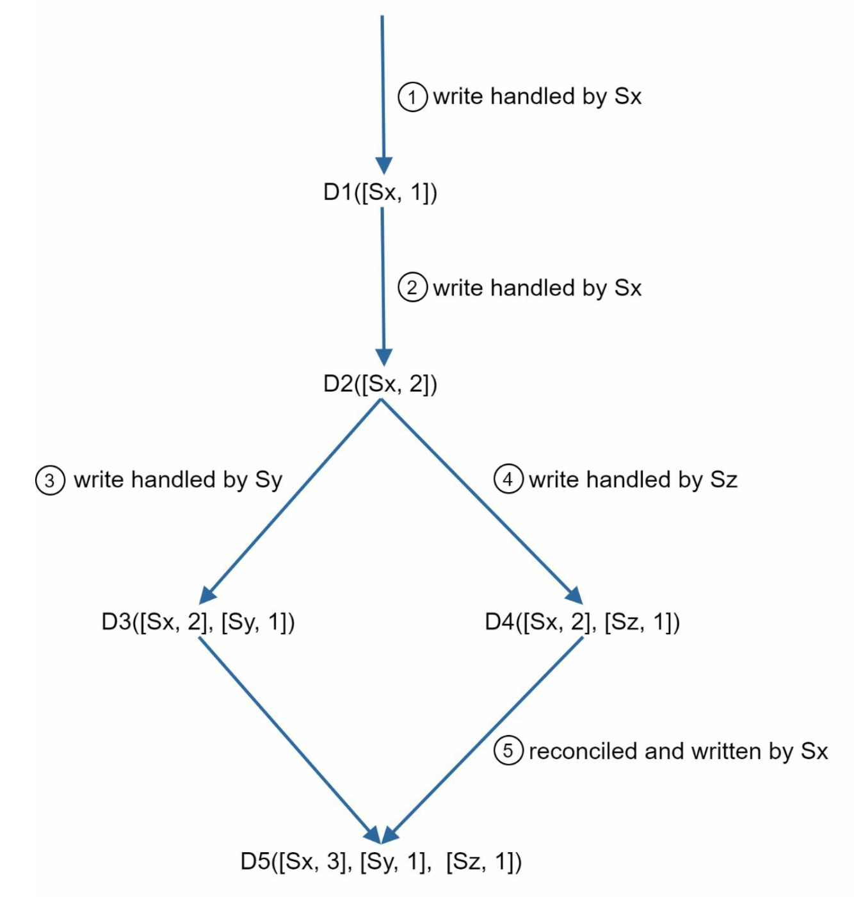
* X is ancestor of Y if each participant in the vector clock of Y is greater than or equal to in X. Example,
  *D([s0, 1], [s1, 1])] is an ancestor of D([s0, 1], [s1, 2])*
* X is sibling of Y if there is any participant in Y's vector clock who has a counter that is less than its
  corresponding counter in X. Example, *D([s0, 1], [s1, 2]) and D([s0, 2], [s1, 1])*
* Resoulution :
    1. __Automatic merge__ : If the data is mergeable, merge them. Example, *Shopping cart*
    2. __Last write win__ : Pick update with latest version.
    3. __Application-level__ resolution : User needs to merge. Example, *Merge conflicts in git*

### Gossip protocal for failure

* Used to know when a server is down.
* Working :
    1. All nodes maintains heartbeats and node ID list(Member list).
    2. Each node periodically increments its heartbeat.
    3. Each node periodically sends their member list info to some random nodes.
    4. The receiver merges this list to their's.
    5. If heartbeat of some node has not increased in a while it is marked as down.

* Passage on Merkel tree from the book,

> What if a replica is permanently
> unavailable? To handle such a situation, we implement an anti-entropy protocol to keep
> replicas in sync. Anti-entropy involves comparing each piece of data on replicas and updating
> each replica to the newest version. A Merkle tree is used for inconsistency detection and
> minimizing the amount of data transferred.
> - Quoted from Wikipedia [7]: “A hash tree or Merkle tree is a tree in which every non-leaf
    node is labeled with the hash of the labels or values (in case of leaves) of its child nodes.
    Hash trees allow efficient and secure verification of the contents of large data structures”.
> - Assuming key space is from 1 to 12, the following steps show how to build a Merkle tree.
    Highlighted boxes indicate inconsistency.
> - Step 1: Divide key space into buckets (4 in our example) as shown in Figure 6-13. A bucket
    is used as the root level node to maintain a limited depth of the tree.
> - Step 2: Once the buckets are created, hash each key in a bucket using a uniform hashing
    method (Figure 6-14).
> - Step 3: Create a single hash node per bucket (Figure 6-15).
> - Step 4: Build the tree upwards till root by calculating hashes of children (Figure 6-16).
> - To compare two Merkle trees, start by comparing the root hashes. If root hashes match, both
    servers have the same data. If root hashes disagree, then the left child hashes are compared
    followed by right child hashes. You can traverse the tree to find which buckets are not
    synchronized and synchronize those buckets only.
> - Using Merkle trees, the amount of data needed to be synchronized is proportional to the
    differences between the two replicas, and not the amount of data they contain. In real-world
    systems, the bucket size is quite big. For instance, a possible configuration is one million
    buckets per one billion keys, so each bucket only contains 1000 keys.

## Chapter 7 : Unique ID generator

----------------------------------

### Multimaster approach

* Uses databases autoincrement feature.
* Web server gets IDs from the multiple database server and the ID are incremented by <code>k</code>, which is the
  number of the database servers.
* Example,

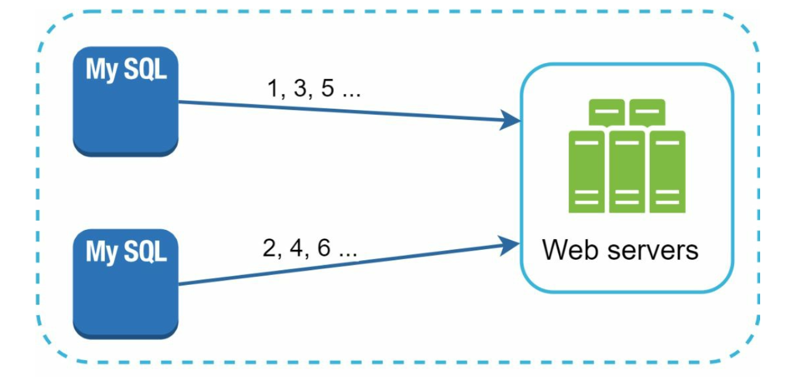

* Problems,
    1. Does not scales well when servers are added or removed.

### UUID

* 128-bit unique ID generator. Example, *09c93e62-50b4-468d-bf8a-c07e1040bfb2*
* Every web server will have its own UUID generator.
* Cons,
    1. IDs are 128 bits long, but our requirement is 64 bits. *(Why cant the size be reduced?)*
    2. IDs do not go up with time. *(Its are requirement that it should go up with time, but does that even matters)*
    3. IDs could be non-numeric.

### Ticket server

* Multiple server calls one database and get ID using it's auto increment feature.
* Example,

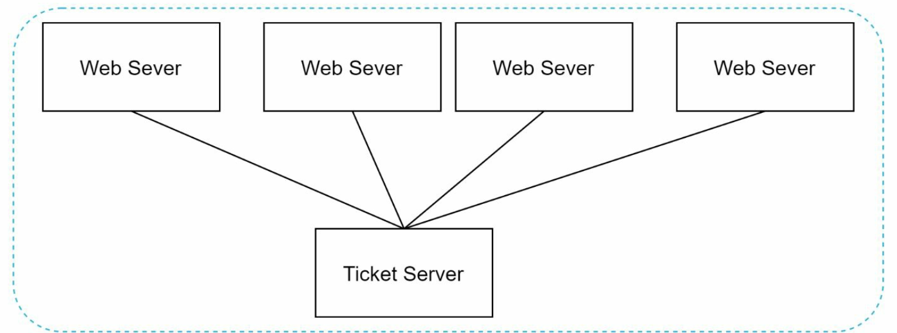

* Cons, single point of failure.

### Twitter's snowflake approach

* Divides the unique ID into bit sections,
* Example,

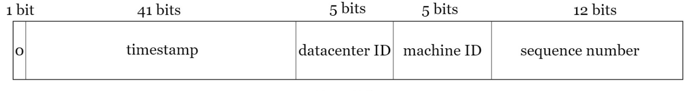

* Sections,
    1. Sign bit : Always 0, for future use.
    2. 41 bits : timestamp(in millisecond)
    3. 5 bits : Datacenter number, 2<sup>^</sup>5 = 32 datacenters
    4. 5 bits : Machine number, 2<sup>^</sup>5 = 32 machine
    5. 12 bits : Sequence number, will increment by 1 for every request and will reset to 0 after every millisecond. 12
       bit means 2^12 combinations = 4096 unique ID every millisecond

## Chapter 8 : URL shortner

---------------------------

### Calculation

1. Write operation: 100 million URLs are generated per day.
2. Write operation per second: 100 million / 24 /3600 = 1160
3. Read operation: Assuming ratio of read operation to write operation is 10:1, read
   operation per second: 1160 * 10 = 11,600
4. Assuming the URL shortener service will run for 10 years, this means we must support.
   100 million * 365 * 10 = ***365 billion*** records.
5. Assume average URL length is 100.
6. Storage requirement over 10 years: 365 billion * 100 bytes * 10 years = 365 TB

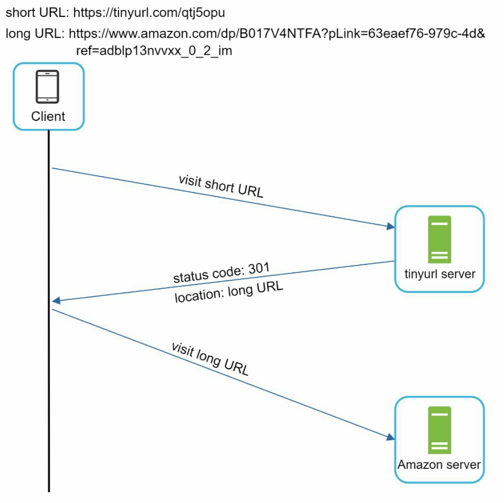

### 301 v/s 302 redirecting

Whenever a short URL is used a `GET` request is send to the URL shortening service. Now 2 things can happen,
either the response status is 301 or 302.

* 301 : Permanently moved i.e. the URL is cached and the next request with the short URL will not go to the shortening
  service. Used to reduce server load.
* 302 : Temporarly moved i.e. the next request with the short URL will go to the shortening service. Used when we
  require analytics.

### URL shortening

* Form : &lt;HOST&gt;/{URL_HASH}

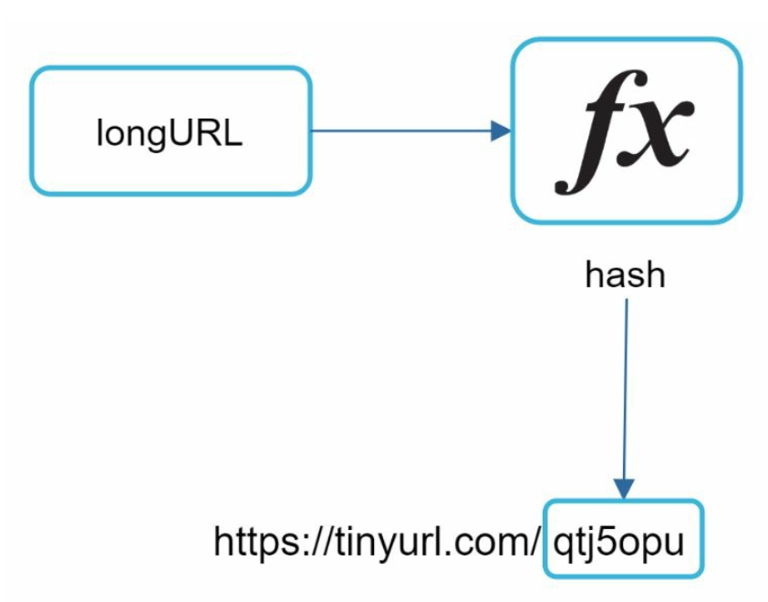

* The hash function must satisfy the following requirements:
    1. Each longURL must be hashed to one hashValue.
    2. Each hashValue can be mapped back to the longURL.

### Data Model

* Store in hash map, example, `shortURL -> longURL`. Memory will exhaust soon as this stored in main memory.
* Store mapping in relational database.

### Hash value:

* Consist of [0-9, a-z, A-Z], containing 62 elements. 62^n ≥ 365 billion, [refer](#calculation). 62^7 = ~3.5 Trillion
* Base 62 conversion is used to hash the URL. Example, 11157<sub>10</sub> = 2TX<sub>62</sub>
* When a new URL is encountered which is not present in the database, we save in the DB against a primary key.
  This primary key is converted base 62 and mapped to the long URL.
* Example,

<table>
  <tr><th>Id</th><th>Long</th><th>Short</th></tr>
  <tr><td>11157</td><td>www.example.com/long/url</td><td>2TX</td></tr>
</table>

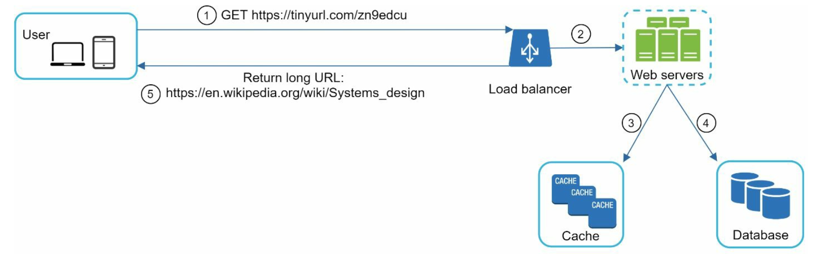

## Chapter 9 : Web Crawler

--------------------------

### Calculations

* Crawler collect 1 Billion pages a month
* Store up to 5 yrs
* Duplicate pages should be ignored
* QPS: 1,000,000,000 / 30 days / 24 hours / 3600 seconds = ~400 pages per second.
* Average web page size : 500k
* 1-billion-page x 500k = 500 TB storage per month
* 500 TB * 12 months * 5 years = 30 PB

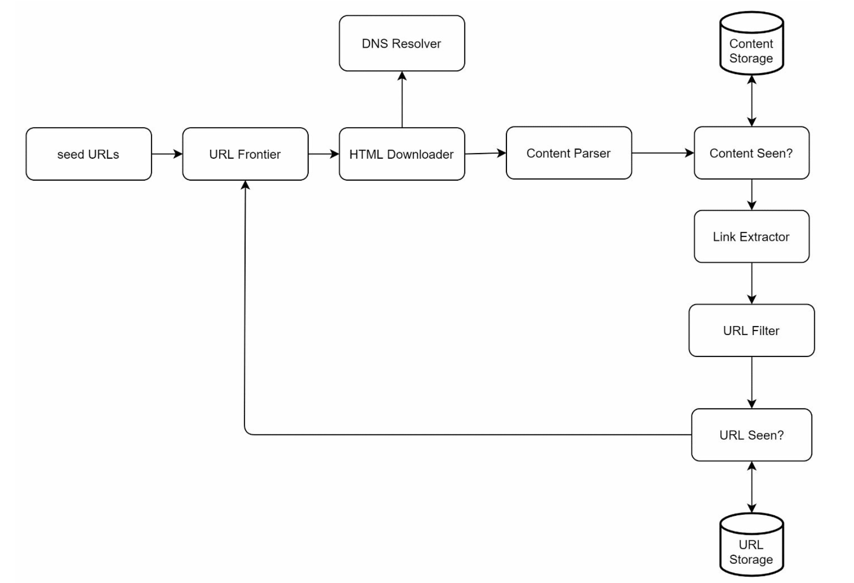

* Seed URL : Starting URL
* URL Frontier : Storage for URLs to be downloaded
* HTML Downloader : Downloads HTML pages from web
* DNS Resolver : URL -> IP
* Content parser : validate web page for malformed web pages
* Content seen? : Checks for duplicate web pages by checking hash
* Content storage : Most of the content is stored on disk, popular content stored in cache
* URL Extractor : extract links from web page
* URL filter : Filter certain content type, file blacklisted sites
* URL seen? : Keeps track of already visited URLs (which are in frontier)
* URL storage : stores URL

### DFS v/s BFS

* BFS is preferred over DFS as it gets too deep.
* Problems with BFS :
    1. Most web pages are linked back to same host, example, wikipedia pages
    2. BFS don't take priority into consideration

### URL Frontier

* Store URL to be downloaded.
* Politeness : Sending requests to a server frequently should be avoided as it can be considered as DOS attack.
* Ensuring politeness:
    1. Mapping table : Website host to queue mapping.
       <table>
         <tr><th>Website</th><th>Queue</th></tr>
          <tr><td>wikipedia.com</td><td>b1</td></tr>
       <tr><td>google.com</td><td>b2</td></tr>
       </table>
    2. Queue router : ensures each queue contains URL from same host.
    3. FIFO Queues
    4. Queue Selector : Selects which queue to take URL from.
    5. Worker thread : Downloads web page delay can be added.

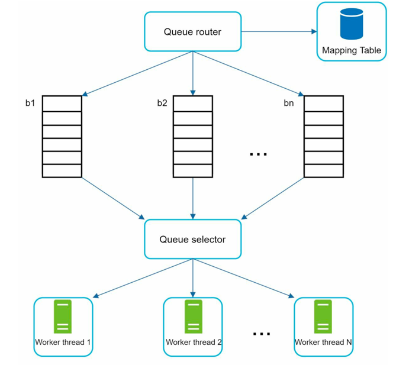

* Priority : Not all URL have same priority. URLs are prioritized base on usefulness.
* Ensuring priority :
    1. Prioritizer : Takes URL and computes priority.
    2. Queue : Each queue is assigned a priority and URL with higher priority goes to queue with a higher priority.
    3. Queue selector : Randomly chooses a queue with bias towards higher priority queue.

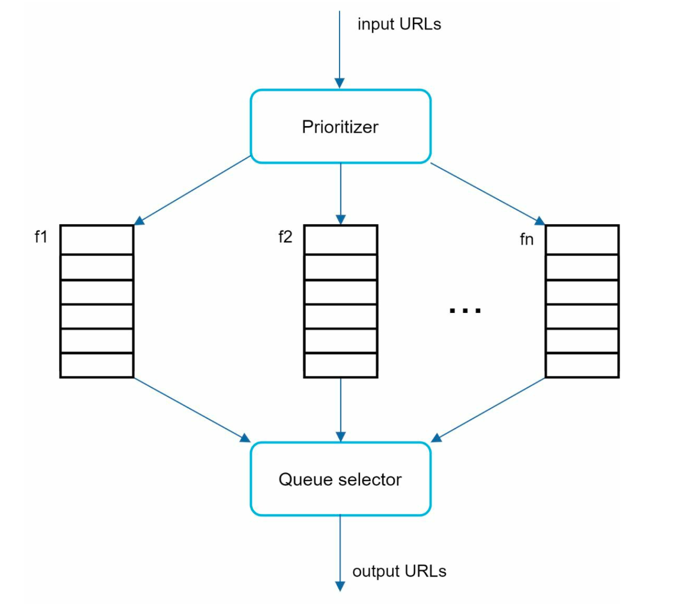

* Storage for URL frontier : If store on disk, read-write ops are slow. If stored in memory, not scalable.
* Hybrid storage approach : The majority of URLs are stored on disk, so the storage space is not a problem.
  To reduce the cost of reading from the disk and writing to the disk, we maintain buffers in memory for enqueue/dequeue
  operations. Data in the buffer is periodically written to the disk.

* Robot.txt : Robots Exclusion Protocol, is a standard used by websites to communicate
  with crawlers. It specifies what pages crawlers are allowed to download. Example,
  ```txt
  User-agent: Googlebot
  Disallow: /creatorhub/*
  Disallow: /rss/people/*/reviews
  Disallow: /gp/pdp/rss/*/reviews
  Disallow: /gp/cdp/member-reviews/
  Disallow: /gp/aw/cr/
  ```

### Performance optimization

* Distributed crawl : URL frontier distributes all the URLs to multiple download servers.

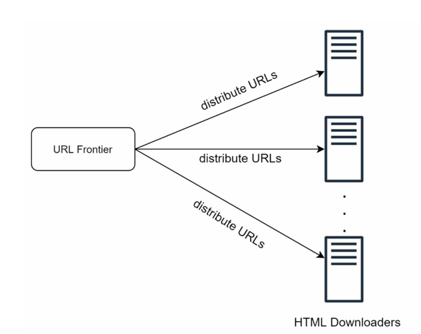

* DNS cache : DNS is a bottleneck as a crawler might encounter multiple duplicate hosts and going waiting for DNS costs
  time.
  So cache the DNS response for URLs save time.
* Short timeout : Some server may respond slow or dont respond at all, to prevent wasting time use short timeouts.

## Chapter 10 : Notification System

-----------------------------------

### Different type of notification:

* iOS : Provider -> APNS(Apple Push Notification Service) -> Device. Provider build and send notification. It required a
  `DeviceToken`
  and a notification payload.
* Android : Uses FCM(Firebase Cloud Messaging) similar to APNS.
* SMS : Uses commercial services like Twilio and Vonage.
* E-Mail : Companies can setup their own email server but most user already available services like Mailchimp.

### Contact info gathering

* Apps gather contact info when a user signs up for the first time.
* Contact info includes, phone number, email, device token.

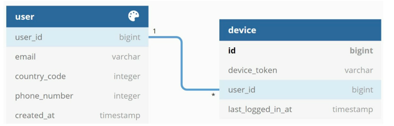

### Notification sending/receiving flow:

* Service : A service can be an application, cron job etc sending notifications like SMS, billing communication etc.
* Notification system : All the services send notification data to notification service. Send notification payload to
  thrid-party
  service.
* Third-party service : Example, APNS, FMC etc. Notification system sends data here. These service are responsible for
  sending
  notifications to devices. Need to be careful with these service as they might be down or not available. So we need to
  make sure
  that our notification system can easily plug or unplug them.

### Problems:

* Have one notification server lead to Single Point of Failure.
* As a single server is handling everything it is hard to scale database and cache.
* Handling and sending notification is resource intensive and can lead to overload on a single server.

### Improvement:

* Add more notification server using auto scaling.
* Use queue to decouple systems.
* Move DB and cache out of notification server.

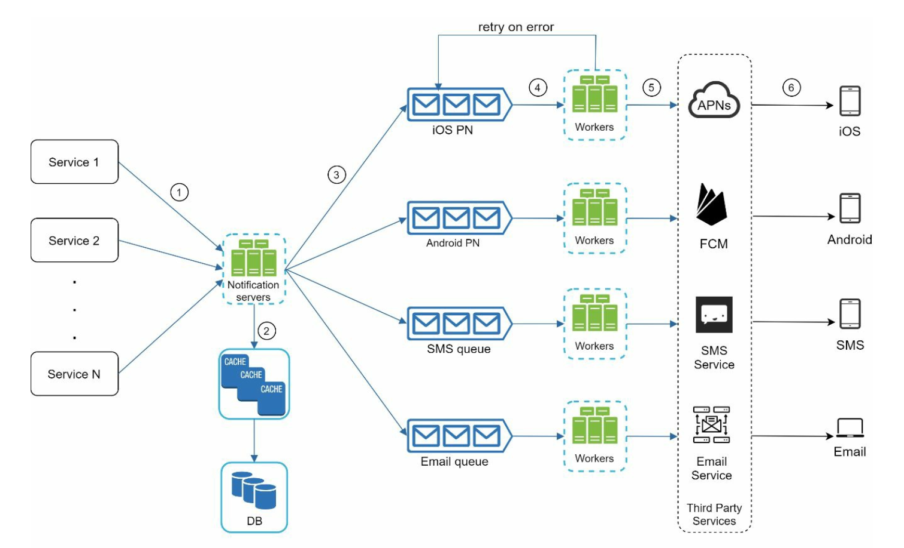

* Service call notification system's APIs to send notification data. The System fetched `user_id`, `device_token` etc
  from
  cache or DB. Notification system send events to different queues (example iOS PN queue in the above image), worker
  then
  pull these event from the queue and send them to third-party services which then send the notifications to actual
  devices

### Misc

* Reliability : A notification system cannot lose data, to do this systems implement retry mechanism and maintain
  notification logs.
* Notification templates : Systems have templates ready so that they done have to create every message from start.
  Example,
  `You dreamed of it. We dared it. [ITEM NAME] is back — only until [DATE].`
* Notification setting : Before sending notification we check if user have opted for that notification to be send or
  not.
* Monitoring : If the notifications in the queue increases that mean worker not processing the notification fast enough
  and we need more workers.
* Event tracking : We need to monitor open rate, click rate, and engagement to understand customer behaviour.

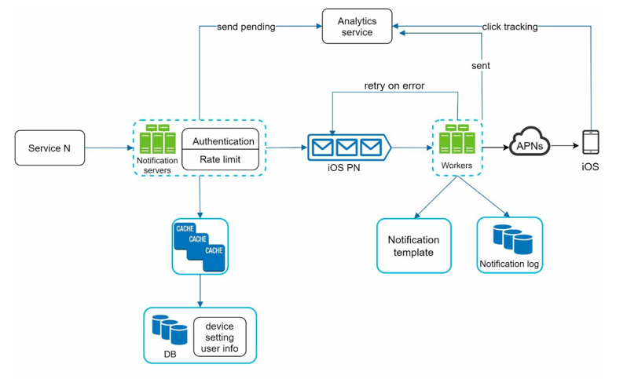

## Chapter 11 : News Feed

-----------------------------------

### News feed APIs:

* `POST /api/feed?content=<>&auth_token=<>` to add post.
* `GET /api/feed?auth_token=<>` to get post.

### Feed publishing :

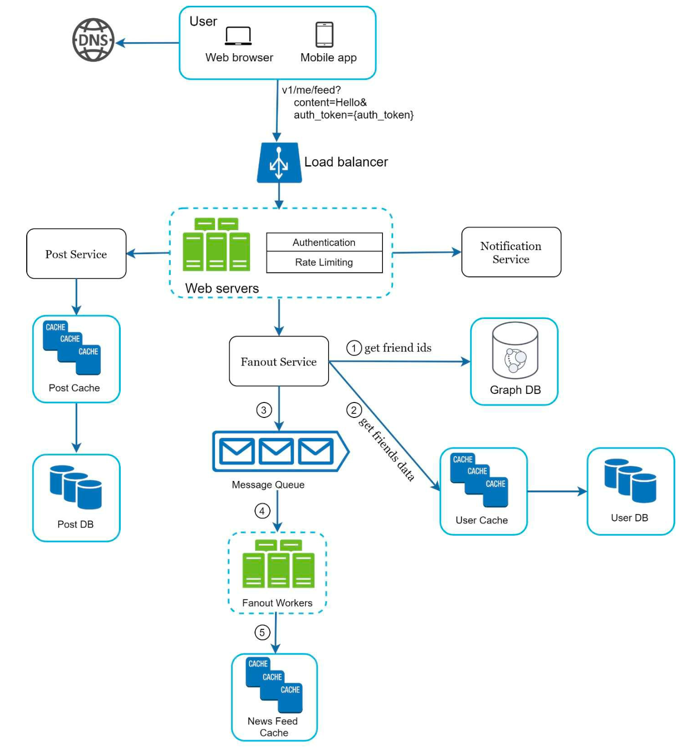

* Fanout Service : Deliver post to all friends. Has 2 types:
    1. Fanout on write : When someone posts, the content is populated to feed of all the friends.
        1. Pros : Feed is generated in real time and reaches friends immediately.
        2. Cons: Celebrity problem and feed is also computed for user who dont login much.
    2. Fanout on read : Post/content is computed when some want to see their feed.
        1. Prod : No Celebrity problem and good for people who dont login much.
        2. Cons : Fetching feed is slower
* We use a hybrid of FoW and FoR. For most people FoW is used but celeb and peoples wit many friends FoR is used.
* Fanout service working:
    1. Fetch `friend_id` from Graph DB. Graph DB is good choice to store thing like relations.
    2. Get friends info from user cache.
    3. Send friend list and post id to queue.
    4. Fanout worker store news feed data into cache as
        <table>
         <tr><th>newsfeed_id</th><th>post_id</th><th>user_id</th></tr>
       </table>

### Feed Retrieval :

1. Request goes to news feed service.
2. This service get news feed data from new feed cache explained above, also it retrieves user and post info from user
   and
   post caches.
3. All this info is curated into a single JSON and is send to the client.

### Cache Architecture :

1. News Feed : Stores `newsfeed_id`
2. Content : Stores every post data, popular data is stored in hot cache.
3. Social graph : Stores relation data. Follower and following data.
4. Action : Store analytical data, user liked a post, replied to it, share it etc.
5. Counter : Store like, follower, following count.

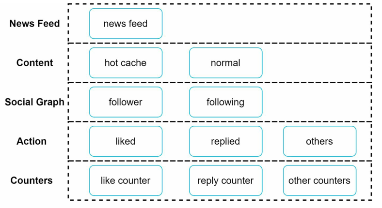

## Chapter 12 : Design Chat App

--------------------------------

### Requirements

* A one-on-one chat with low delivery latency
* Small group chat (max of 100 people)
* Online presence
* Multiple device support. The same account can be logged in to multiple accounts at the
  same time.
* Push notifications
* 50 million daily active users

### HLD

* Clients (Web/App) do not directly connect with each other, they connect with a chat server.
* Sender client sends message to chat server.
* Sending message from chat server to receiver is complicated, here are some strategies used,
    1. Polling : Receiver client keeps sending request to chat server periodically.
        - Cons : This is costly.
    2. Long Polling: A connection from receiver is opened to chat server and is kept open until a new message is
       received or a timeout
       is hit. Once any of this happens a new connection is opened again.
        - Sender and receiver might not connect to the same server
        - Inefficient
    3. WebSocket : This is connection initiated by a client. Using this server can send message to client.

* This application comprises of:
    1. Stateful service : Main chat service.
    2. Stateless service : Account detail, online/offline(presence servers) etc.
    3. Third-party service : Notification system.

### Data storage:

* Stateless service data like, account details, presence data etc can be stored in relational DB.
* Chat should be stored in KV DB because:
    - Allow easy horizontal scaling, fast, adopted by other chat systems.


