## Introduction :

* IPO : Initial Public Offer. Way to introduce a company's share in the market.
* Target : Selling price of a share. Buys a share for 10 then target of 20 means in coming days, months, weeks etc
  this share will/might reach 20.
* Stop Loss : Min selling price to sell a share. Buys a share for 10, it started to fall, 9.5 -> 9 -> 8......
  So stop loss can be 8, making a loss of 2 (Minimum loss you can handle).
* Buy <SHARE_NAME> <BUY_AT> <TARGET> <STOPLOSS>, Example : Buy TATA 400 450 390
* Upper Circuit : Limit above which a share price cannot go in one day.
* Lower Circuit : Limit below which a share price cannot go in one day.

## Session 1 - 6 Sept 25

* Analysis type :
    1. Technical Analysis : Checking Price and Volume. Quick.
    2. Fundamental Analysis : Checking all the stocks one by one and then invest in the best. Time taking.

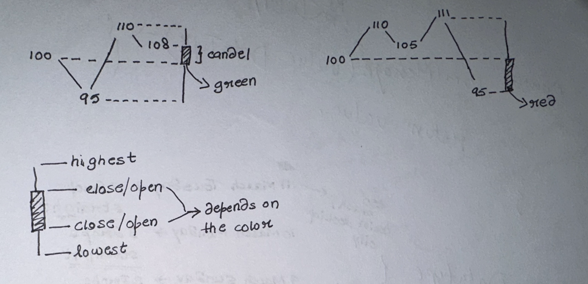

* Colored part of candle is called real body
* Upper line is called upper wick
* Lower line is called lower wick

## Session 2 - 7 Sept 25

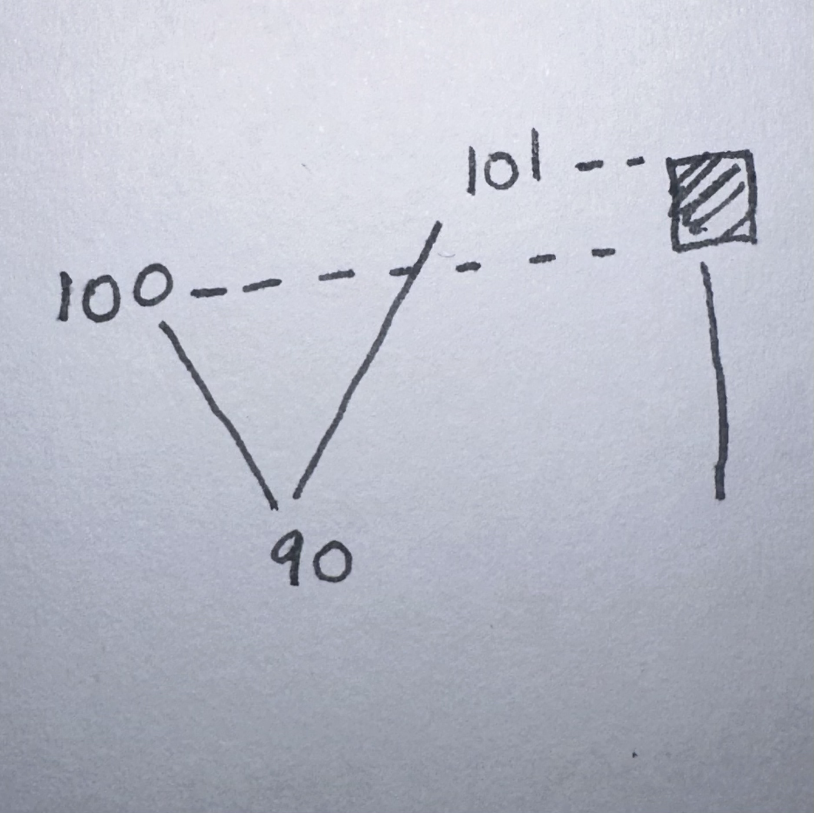

* Lower wick means sellers are facing resistance or are being rejected. In the above image seller face rejection at 90.
  **Also lower wick denote Bulls**

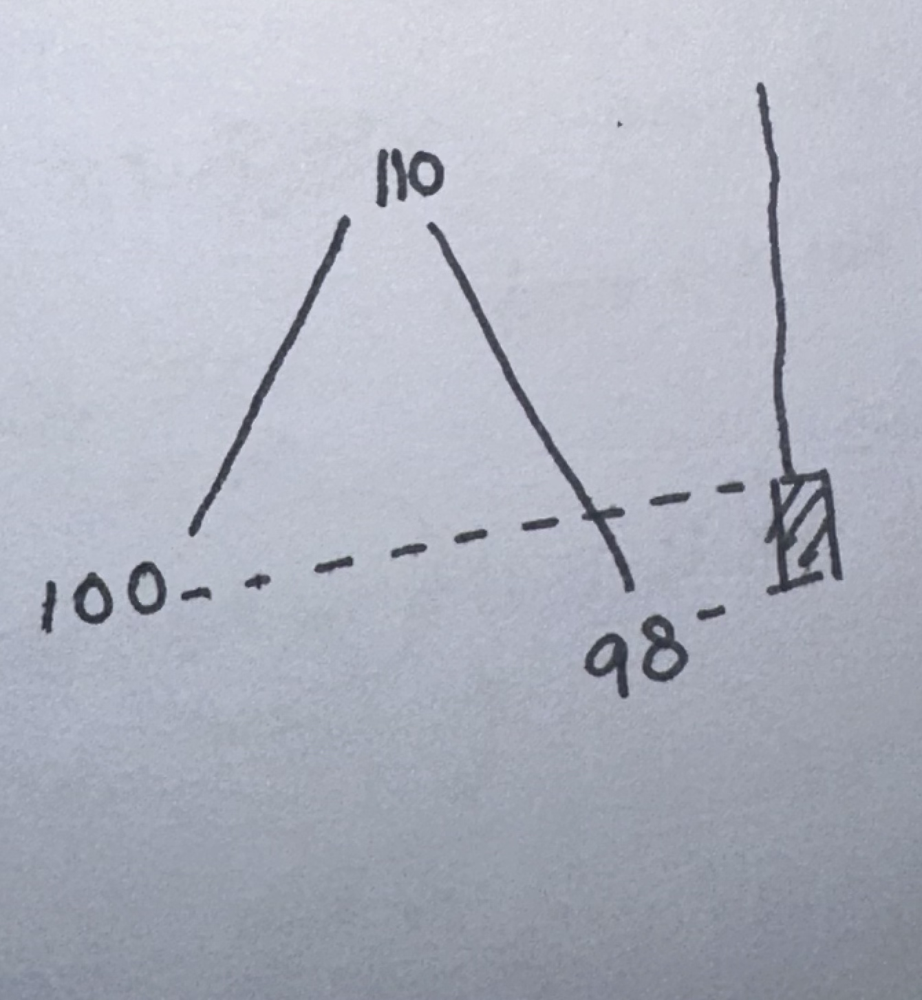

* Upper wick represents buyer were rejected. They took the price till 110 and strong sellers came and took it to 98.
  **Also upper wick denote Bears**

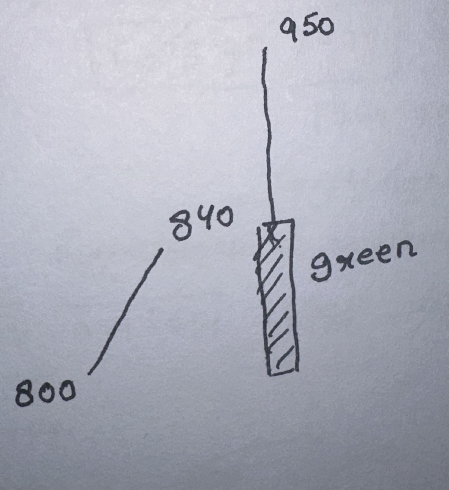

* Bear points in above example 950-840 = 110
* Bulls point are 840-800 = 40
* Bear are winners.

* History repeats itself
* Price moves in trend.
* Market discount everything

## Session 3 - 13 Sept

* When company perform/does not perform people buy/sell the stock which affects the prices.

* For long term 2Y-3Y, see monthly chart
* For mid term 1Y, see weekly chart
* For short term Day to Month, see daily chart

### 4 kind of invertor/traders

* Quick trading : Buy and sell within 15-20 working days(1 month), Daily charts
* Short term trading/Swing trading : Buy and sell within 3 months, Daily or weekly charts
* Mid term : Buy and sell within 3 month to 1Y, weekly charts
* Long term : Buy and sell after 1Y< , monthly charts

* The low of a candle whos immediate candle's lows are greater is called `Swing Low`.
  Color doesn't matter.

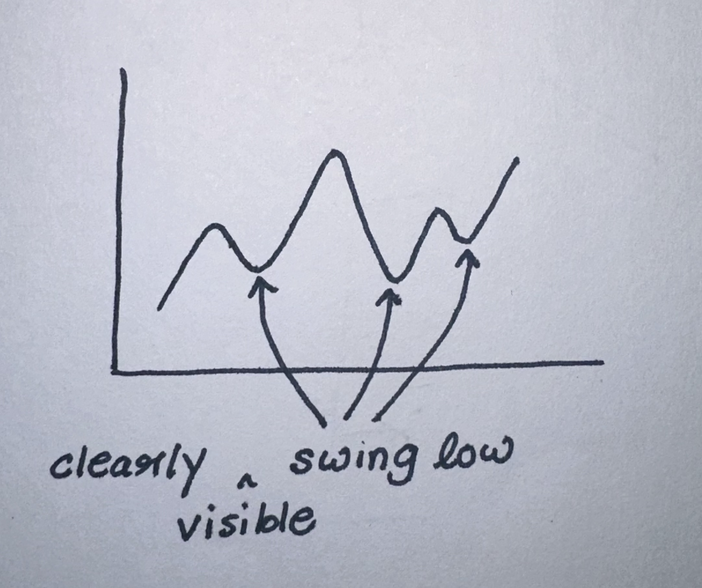

* Stop Loss : This is **recently** clearly visible swing low. Used minimise loss.
* Keep Stoploss 1% below RCVSL.

## Session 4 - 14 Sept

* For newer stock check on 1D
* `Swing high` is needed to decide target.
* `Swing low` i.e stoploss should be one, `Swing High` i.e. target should me multiple.
* `Horizontal Support` : Horizontal line that connect minimum 2 swing lows without breaking any candle
* Cannot trust support if it breaks.
* If support breaks, that mean the buyers dont see worth or seller force is very strong.
* `Horizontal Resistant` : Horizontal line that connect minimum 2 swing high without breaking any candle
* If resistance breaks, that mean either sellers are not selling or buying force is very strong.
* When to buy:
    * if a stock breaks resistance, that mean it'll go high
    * if it hits support and starts moving up, this means it will go till (or might break) resistance.

## Session 5 - 20 Sept

* If we buy at time of support reversal and the support breaks, then sell it below 1% of support.
* Support are of 3 type : Sideways(Horizontal), Up trend, Down trend
* Trend : Start with major swing and should not be very step

## Session 6-7 - 21 Sept/27 Sept

* Buy when prices reverses from support (horizontal / rising) or it breaks resistance.
* 1D : 1M - 1.5Y long support line
* 1W : 5Y-6Y long support line
* 1M : 5Y+ long support line
* Price Action : will use after 1-1.5Y
* Candlestick pattern:
    1. Bullish Engulfing : At support there should be a red candle and next there should be a big bullish green candle
       that covers the previous red candle, also the volume should be good. **2 Candlestick pattern**
       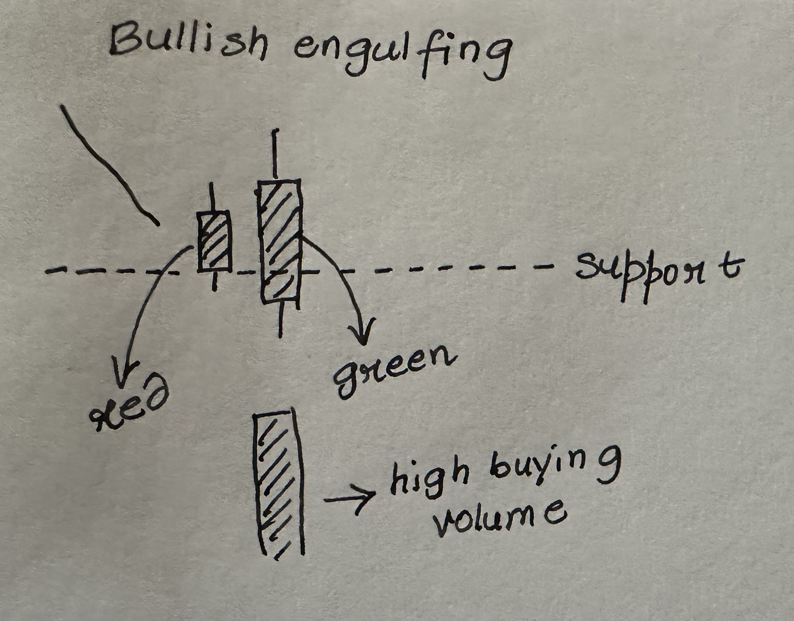
       We have to buy at upper wick of bullish engulfing if the prices sustains for 15 minutes on the next/coming days.
       Don't but until and unless it break bullish engulfing's high (may even have to wait for 10-15 days)
       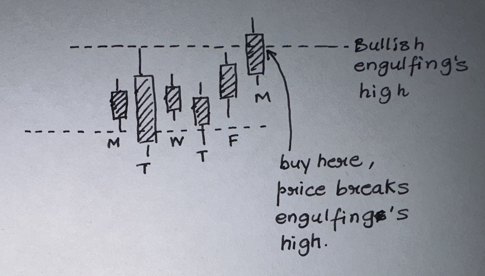
       Target in this case will be upcoming CVSH and stoploss is when price breaks support/low of bullish
       ==*(Which ever is low)*== engulfing or goes below it.
       If bullish engulfing's low breaks, that means it is a fake engulfing and we should not buy even if in coming days
       the price cross engulfing's high
       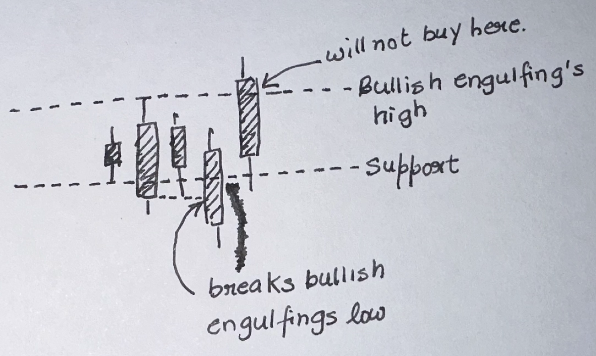
       Sometimes bullish engulfing can be fake, some group of buyer buy and raise the price. So follow these pattern on
       a bigger time frame like 1W, 1M and *not 1D*. Only apply these concept in top 100-200 companies of India.
       Confluence of horizontal and rising support can high accuracy.
    2. Hammer : Small real body, Big lower wick. **1 Candlestick pattern**
       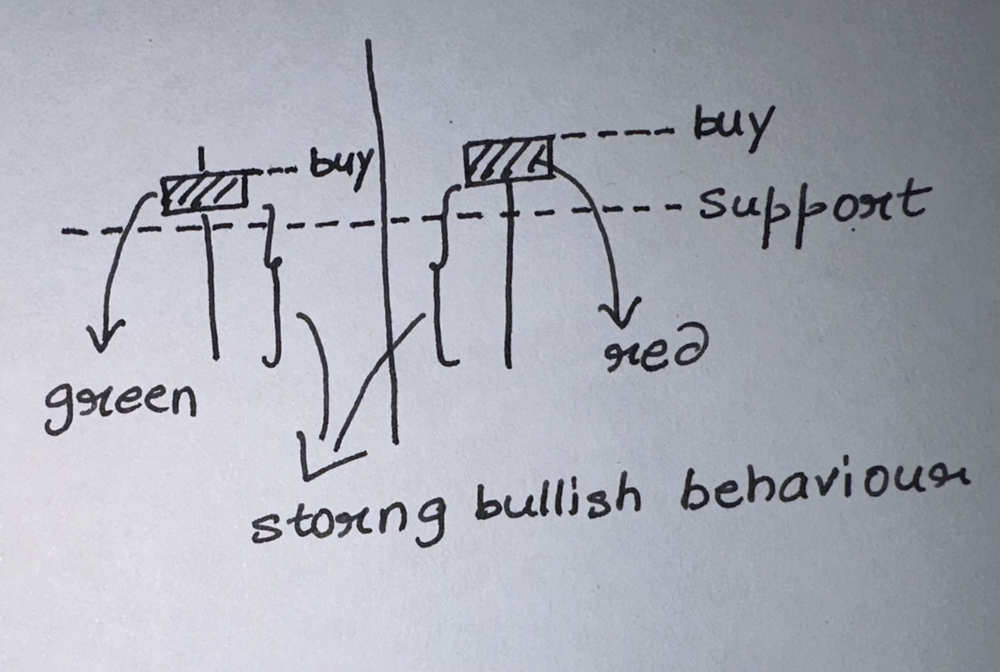
       Buy at highest of hammer, Stoploss at min(hammer's low, support). Lower should be min 2x of real body
    3. Morning Star : A big red candle, dogi(indecisive) next, and big green candle that passes mid of the last
       red candle. Buy at high of green candle, Stoploss at Min(Big red, dogi, big green)
       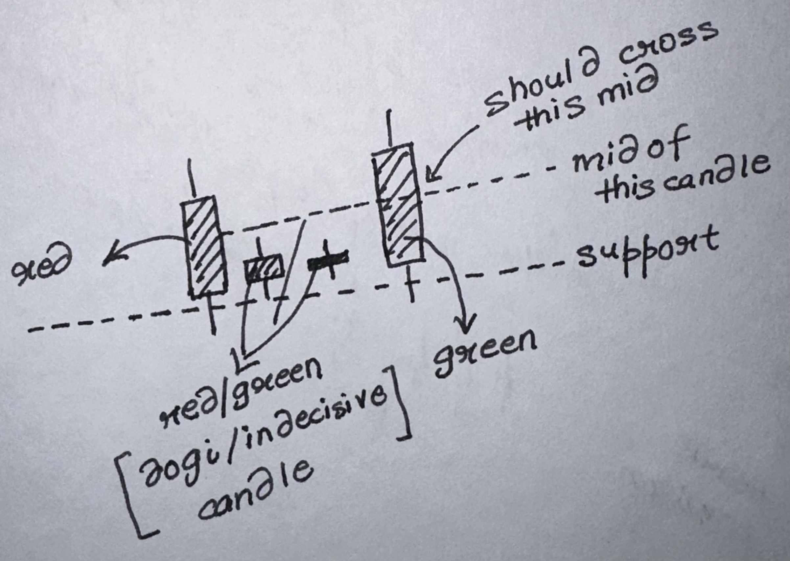

* Will used these techniques only on NIFTY 200 stock.

## Session 8 - 28 Sept

* SMA will be checked on **1D**
* Aggressive Investing : When time is right invest all, When current market prices is above SMA 20 and 50
* Mild Investing : When market is not performing well, invest half of the capital,
  current market price is below SMA 20 or SMA 50
* No Investing : When market is poor, do not invest or invest 1/4th of the capital,
  current market price is below SMA 20 and SMA 50
* Breakout : Whenever price breaks the resistance *with a view to change the trend*.
  

* **A** is Breakout as the price is breaking the resistance and is also changing the trend from falling to rising.
* **B** is *not* a breakout as the price is breaking the resistance but is not changing the trend, trend was rising
  and is still rising.
  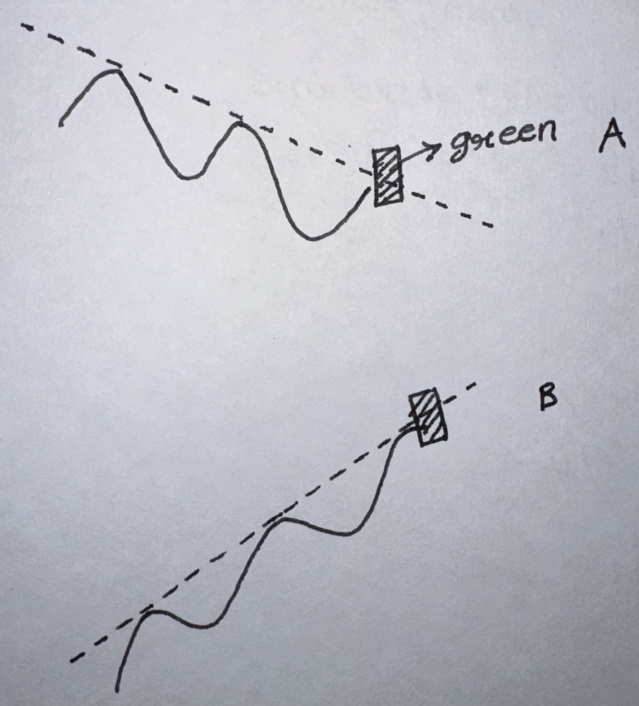
* For breakout Horizontal and Falling resistance are monitored.

## Session 9 - 4 Oct

* Buy only on the basis of SMA 20, 50, 100 on NIFTY500.
* Confirm breakout: Whenever price breaks the resistance and closes above it.
* Confirm breakout happens only with a Bullish Candle and High volume
* MOTHER : **Valid for 1W | Medium term**
    1. Multiple Touch Resistance.
    2. 3 touch minimum.
    3. 2 touch can be considered if the stock is on all time high.
    4. Buying range 7-8% of break out.
    5. Target : 20-25% of breakout.
    6. Length of resistance *1-1.5Y <*
    7. At breakout, big bullish candle with good real body.

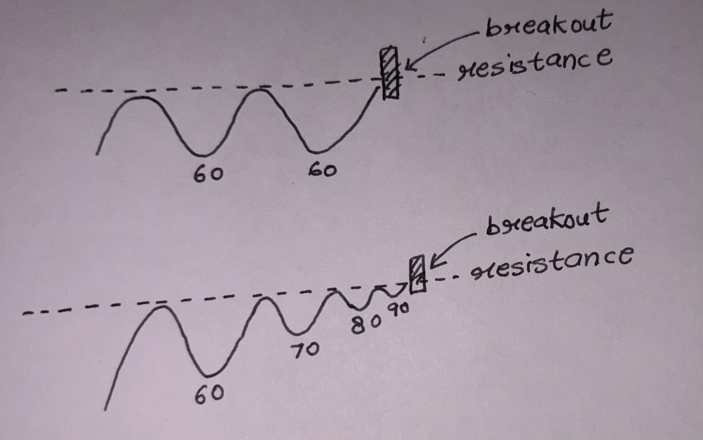

* Points to remember based on above image:
    1. Both are MOTHER.
    2. In the first figure stoploss is lower (60) and in the lower one it is higher (80). Implies Rising support
       is mandatory.
    3. In the first figure buyer are buying at 60 but in the second figure buyer are ready to pay more
       (60 -> 70 -> 80 -> 90), higher lows before breakout
    4. Volume should be high.
    5. SMA 10 should be 12-25% of the price

* Stoploss can be identified based on these conditions:
    1. Recently visible swing lows
    2. Rising or horizontal support
    3. Based on SMA (in later session)

* Multiple touches should be coming closer and closer.

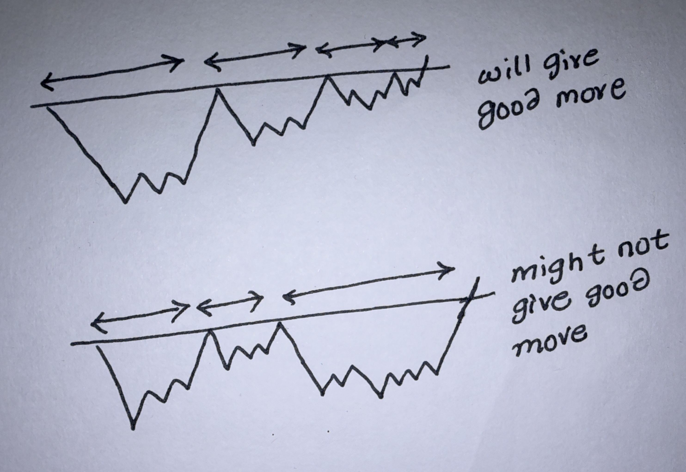

## Session 10 - 5 Oct

* FATHER :
    1. Falling Trend Line Resistance.
    2. Multiple touches, minimum 3.
    3. If on All-time high, 2 touches allowed. (In rare scenarios)
    4. Higher lows.
    5. SMA 10 will b/w 12-25%
    6. Volume should be high.
    7. Trend line should not be very steep
    8. There should be prior uptrend before FATHER

* If there is prior uptrend before MOTHER/FATHER then it works very well
* For FATHER uptrend is mandatory but for MOTHER it is not

## Session 11 - 11 Oct

* In case of MOTHER/FATHER buying range should be 7-8%, if the prices close between 0%-8% of breakout then
  we can buy on Monday/next day. If resistance id 100 and B/O happens between 100-108 we can buy.

* Stocks for 1M FATHER/MOTHER B/O
    1. BALRAMPUR
    2. INDIAN HOTELS
    3. USHA MARTIN LTD
    4. ELECON ENGG
    5. PRAKASH INDUS LTD

<table>
    <tr><th></th><th>Daily(D)</th><th>Weekly(W)</th><th>Monthly(M)</th></tr>
    <tr><td>Length of resistance</td><td>1M-1.5Y</td><td>1-5Y</td><td>6Y+</td></tr>
    <tr><td>Number of swing high touches</td><td>Min 3</td><td>Min 3</td><td>Min 3</td></tr>
    <tr><td>Touches in case of ATH</td><td>Min 2</td><td>Min 2</td><td>Min 2</td></tr>
    <tr><td>Higher low before breakout</td><td>Yes</td><td>Yes(Check on weekly TF)</td><td>Yes(Check on weekly TF)</td></tr>
    <tr><td>Volume at breakout</td><td>High volume(2x/3x/4x)</td><td>High volume(2x/3x/4x)</td><td>High volume(2x/3x/4x)</td></tr>
    <tr><td>Buying range</td><td>Quick trader : Check if stock breakout for 15 min, 1-2% | Short-term : Wait for confirm B/O at day end and buy next day, 3-4%</td><td>7-8%</td><td>12-15% | Dont wait for monthly price to close, check weekly closing above resistance</td></tr>
    <tr><td>Stoploss</td><td>Quick : SMA | Short-term : Swing low or rising support</td><td>Swing low or rising support</td><td>Swing low or rising support</td></tr>
    <tr><td>Target</td><td>Quick trading : 3% - 7% - 10%| Short-term : Swing high or 10-12%</td><td>Clearly visible swing high or 20-25%</td><td>Clearly visible swing high or 40-50%</td></tr>
    <tr><td>For Father</td><td>-</td><td>Falling trend line should not be very steep(Max 4 o'clock)</td><td>Falling trend line should not be very steep(Max 4 o'clock)</td></tr>
    <tr><td>For Father</td><td>-</td><td>There should be prior uptrend</td><td>There should be prior uptrend</td></tr>
</table>

## Session 12 - 12 Oct

* We have breakout ina stock and also in the sector to which the stocks belong then it can give good move.
* Buy when price reverses from retest zone
* Once breakout happens after that resistance line is called `Resistance turned into Support` / `Retest of B/O`
* If price reverse from retest zone (new support) all support concepts will work, Hammer, Morning Star, Bullish
  Engulfing.

## Session 13 - Oct 17

* Sell whenever price reverse from resistance
* Breakdown : When price breaks support with view to change the trend.
* Confirm B/D : When B/D happens and price closes below support with high selling volume.
* Sell at confirm B/D
* **Never buy on breakdown's retest**

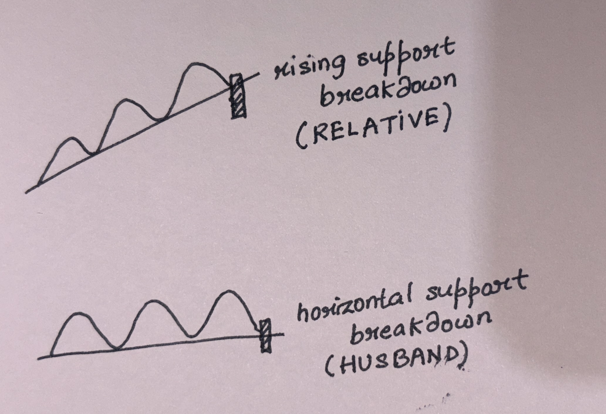

<table>
    <tr><th></th><th>Daily(D)</th><th>Weekly(W)</th><th>Monthly(M)</th></tr>
    <tr><td>Length of resistance</td><td>1M-1.5Y</td><td>1-5Y</td><td>6Y+</td></tr>
    <tr><td>Number of swing lows touches</td><td>Min 3</td><td>Min 3</td><td>Min 3</td></tr>
    <tr><td>Touches in case of ATL</td><td>Min 2</td><td>Min 2</td><td>Min 2</td></tr>
    <tr><td>Lower high before B/D(Falling trend line)</td><td>Yes</td><td>Yes(Check on weekly TF)</td><td>Yes(Check on weekly TF)</td></tr>
    <tr><td>Volume at breakout</td><td>High volume(2x/3x/4x)</td><td>High volume(2x/3x/4x)</td><td>High volume(2x/3x/4x)</td></tr>
    <tr><td>Selling range</td><td>Quick trader : Check if stock breakout for 15 min, 1-2% | Short-term : Wait for confirm B/O at day end and buy next day, 3-4%</td><td>7-8%</td><td>12-15% | Dont wait for monthly price to close, check weekly closing above resistance</td></tr>
    <tr><td>For Relative</td><td>-</td><td>Falling trend line should not be very steep(Max 4 o'clock)</td><td>Falling trend line should not be very steep(Max 4 o'clock)</td></tr>
    <tr><td>For Relative</td><td>-</td><td>There should be prior downtrend before Relative</td><td>There should be prior Downtrend</td></tr>
</table>

* Lower highs :

 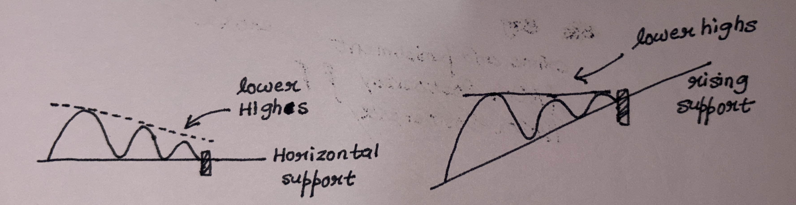

## Session 14 - Oct 18

* Sell when price break resistance.
* Sell when prices breaks resistance, (check for formations like bearish engulfing, evening start, inverted
  hammer/hanging man)
  with high volume.
* Sell whenever price reverses from Horizontal resistance / Falling resistance

* Patterns on resistance :

    

* Summary :

  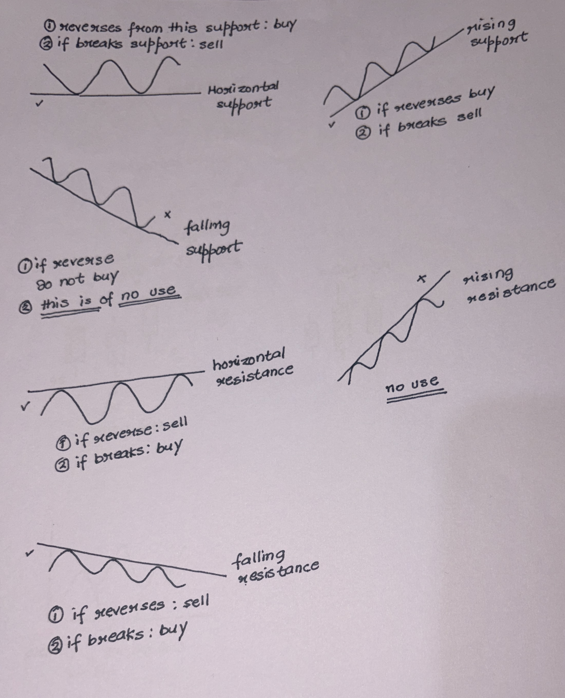

## Session 15 - Oct 25

* SMA : We use 10, 20, 50, 200 candle averages.
* 10D -> Quick term
* 20D -> Short term
* 50D -> Mid term
* 200D -> Long term

* If current price is above SMA then *Bullish*, if current price is below SMA then *Bearish*
* **Use SMA concept on B/Os or retest.**
* At the time of B/O price should be above all the SMAs, *if price is below 200 SMA 60% of the time B/O may fail*.
* Buy on B/O , sell in 3 parts :
    - 1st part : target
    - 2nd part : below 20 SMA
    - 3rd part : below 50 SMA

## Session 16 - Oct 26

* We do not need to check index SMA when buying on support reversal
* If stock is not moving in our favour, aggressive trader can exit if goes below 20 SMA
* If a bearish candle closes 20 SMA, sometimes just even after B/O we should exit.

## Session 17 - Nov 1

* SMAs should be raising or at least horizontal.
* At the time of B/O, RSI should also be above 65.
* At the time of support RSI should also reverse from support.
* If RSI is above 83-85 do not buy.

## Session 18 - Nov 2

## Session 19 - Nov 8

* Buy Futures only on Morning Star.(SL will be very low)
* Buy on reversal on confluence of both horizontal and rising support(BE, H, MS).
* Buy from retest with BE, H, MS + Confluence of rising trend line support

## Session 20 - Nov 9

* Dow theory : If a stock is making higher highs and higher lows it is in uptrend, if it is making lower highs and lower
  lows
  it is in downtrend.
* Unexpected move :
    1. This concept is used on F/O stock or top 200 stocks. This used on on **Daily Timeframe**. Used for buying.
    2. Minimum 15% up-move in 7-8 days without any red candles.
    3. Start counting from low of green or red whichever is low.
    4. Should be a red candle before this move.
    5. Buying opportunity should come after 6-7 months after this move.
    6. Exact buying point will derived 0.786 level of Fibonacci
    7. Start drawing from lowest point to highest price till date of buying.
    8. Target will be 1.5 * Risk. (Risk = Buying price - Stoploss)

* Fundamental Analysis triggers:
    1. Top 200 stocks are the best investment on Weekly timeframe. No need for Fundamental Analysis.
    2. Identify sectorial B/Os
    3. Buy as per technicals, if Fundamentals are not strong don't sell it wait for 2-3 quarterly result.
       High chances companies will start performing better. Company in Profit
    4. Fixed asset expansion
    5. FII / DII
    6. Monopoly B/O
    7. Mother B/O in recently listed IPOs, price should be above all time High ( Mother on ATH)

  